# Motion-Aware SEA-Nav: 面向复杂动态障碍物环境的四足机器人安全导航

> 组会汇报 | 2026-06-21 | 第三周工作
>
> 基于 SEA-Nav 开源项目，调研前沿动态避障方法，构建复杂多动态障碍物导航基座

---

## 一、研究背景与问题定义

### 1.1 SEA-Nav 原始架构与能力

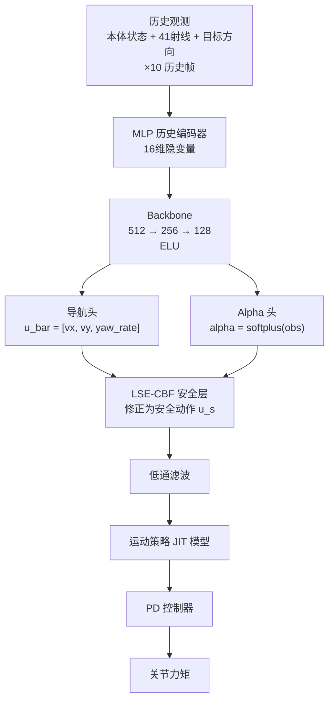

**已实现能力：**
- 静态密集障碍物中 PPO + LSE-CBF + ACSI 的安全高效导航
- 简单动态障碍物：纵向往复运动（0.15~0.40 m/s），圆形近似，射线融合取 `min`
- ACSI 碰撞状态自适应初始化，提高碰撞前关键样本的采样效率

### 1.2 核心能力边界

| 维度 | 已具备 | 缺失 |
|------|--------|------|
| 障碍物运动信息 | 瞬时射线距离 | 相对速度、运动方向、未来轨迹 |
| 安全层机制 | 静态 LSE-CBF（alpha 由历史观测输出） | 动态约束、速度感知安全过滤、motion-conditioned 调度 |
| 观测编码 | MLP 展平历史向量 | 障碍物间空间关系、时序注意力 |
| 奖励塑形 | 碰撞惩罚（事后） | 短时碰撞风险、让行方向引导 |
| 训练策略 | collision-state replay | near-miss replay |

### 1.3 核心研究问题

**如何将 SEA-Nav 从静态密集障碍物环境扩展到复杂多动态障碍物环境？**

分解为四个子问题：

1. **感知层面**：观测中如何显式编码动态障碍物的运动趋势？
2. **安全层面**：CBF 安全层如何从静态距离约束升级为速度感知的动态约束？
3. **行为层面**：奖励函数如何引导策略学会"从障碍物后方通过"的让行策略？
4. **训练层面**：如何让 PPO 在复杂动态场景中获得有效训练样本？

---

## 二、文献调研：动态避障方法体系梳理

### 2.1 调研范围与方法

- 时间跨度：2022-2025
- 检索方向：RL dynamic obstacle avoidance, CBF safety filter, legged robot navigation, crowd navigation, velocity obstacles
- 精读论文：12 篇（RSS, MRS, IEEE OJ-CSYS, JIRS, ICRA, arXiv 等）
- 调研文档：[dynamic_obstacle_literature_review_v1.md](dynamic_obstacle_literature_review_v1.md) / [v2.md](dynamic_obstacle_literature_review_v2.md)

### 2.2 十二篇文献逐一精析

---

#### 论文一：Agile But Safe — 双策略 + Reach-Avoid 值网络 (RSS 2024)

| 作者/机构 | Tairan He, Guanya Shi 等 / CMU, ETH Zürich |
|------|------|
| **硬件平台** | 宇树 Go1 四足（与 Go2 同系列，Isaac Gym） |

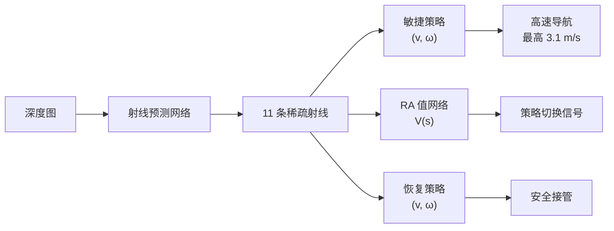

**方法要点：** 敏捷策略负责高速目标导航，恢复策略在碰撞风险升高时接管。核心创新是**策略切换不靠硬编码规则，而由一个学习的 Reach-Avoid 值网络判断**——V(s) 学习预测"从当前状态用敏捷策略继续走，未来多久会撞"，这本质上是一个从数据中学习的安全证书，比手工设计的 CBF 更灵活，不需要预设屏障函数形式。

**创新点：** (1) 学习的安全证书替代手工 CBF——这是安全性保障从"解析构造"到"数据驱动"的范式转换；(2) RA 值网络梯度直接为恢复策略提供"往哪修正最有效"的方向引导；(3) 射线预测网络将深度图压缩为 11 条稀疏射线（SEA-Nav 41 条），适配机载 Jetson Orin NX；(4) 实机验证：Go1 承受 12kg 负载、雪地、外部撞击。

**对 SEA-Nav 的启发：** RA 值网络的思想提示可在 CBF 之上训练辅助值网络来预测未来碰撞风险，动态调节安全裕度——障碍物快速靠近时收紧、远离时放松。四足平台和 Isaac Gym 的一致性说明技术迁移路径清晰。

---

#### 论文二：Online CBF for Multi-Agent Navigation — GNN 在线调参 (MRS 2023)

| 作者/机构 | Zhan Gao, Amanda Prorok 等 / University of Cambridge |
|------|------|

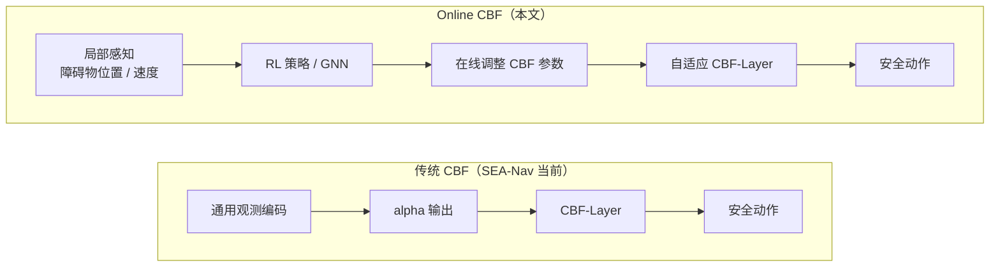

**方法要点：** 传统 CBF 的固定参数在动态环境中要么太保守（freezing robot problem——机器人永远绕行到不了目标），要么太激进（碰撞）。本文提出用 RL 学习一个 CBF 参数调度策略——观察局部障碍物分布，实时决定 CBF 应该保守还是激进，实现"稀疏环境自动放松、拥挤环境自动收紧"。

**创新点：** (1) 首次系统论证了 CBF 参数需要在线自适应而非固定——这是对传统 CBF 理论的重要补充；(2) 用 GNN 参数化策略，天然具有平移不变性和排列等变性——障碍物在左边还是右边、3 个还是 10 个，输出一致；(3) 论证了"为什么用 RL 而非解析方法来调参"——CBF 参数到导航性能的映射是非线性非凸的；(4) 完全去中心化，无需 agent 间通信。

**对 SEA-Nav 的启发：** SEA-Nav 的 alpha 在训练后固定，正好对应本文指出的痛点。可以新增 AlphaAdapter 网络，以局部观测为条件输出时变 alpha 偏置。GNN 的排列等变性为从固定数量 dynamic token 扩展到可变数量障碍物提供了理论依据。

---

#### 论文三：HEIGHT — 异质交互图 Transformer (2024)

| 作者/机构 | Shuijing Liu, Katherine Driggs-Campbell 等 / UIUC |
|------|------|

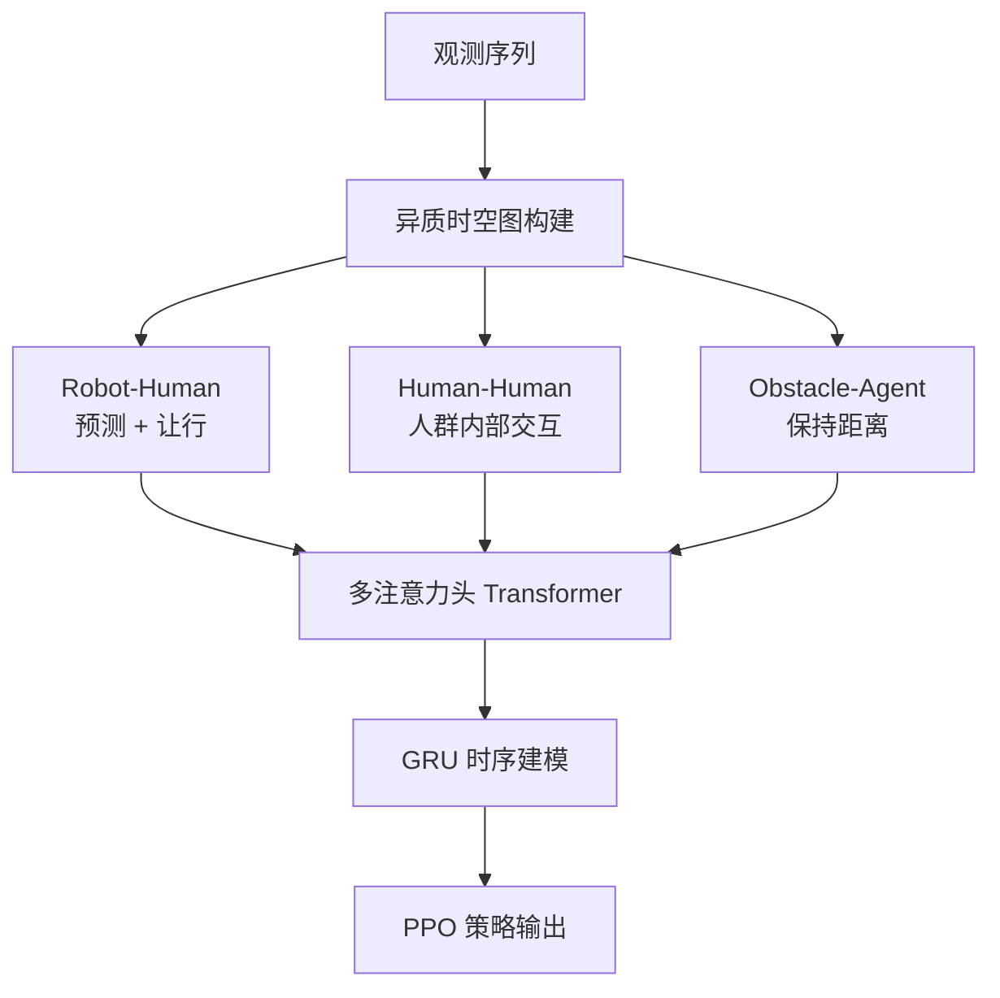

**方法要点：** 传统方法（包括 SEA-Nav）将所有障碍物同质化处理——射线近即危险。HEIGHT 首次区分了三种异质交互：Robot↔Human（需预测意图并主动让行）、Human↔Human（人群内部的交互影响群体运动）、Obstacle↔Agent（静态障碍物只需保持距离）。用多注意力头 Transformer 同时建模空间和时间维度，不同注意力头可分别关注"最近的障碍物"、"最快靠近的障碍物"、"人群密度最高的方向"。

**创新点：** (1) 异质交互建模的核心洞察——不同类型障碍物需要不同处理策略；(2) 多注意力头机制实现了"关注什么"的自动分工；(3) 零样本 sim-to-real 泛化——88% vs 64% 基线(A* + CNN)，训练未见过的拥挤密度下仍工作；(4) GRU 时序建模捕获运动变化趋势。

**对 SEA-Nav 的启发：** "异质交互"思想直接影响了观测设计——将静态 ray 和动态 token 分为两个通道，分别编码空间约束和运动信息。token 被设计为结构化语义向量 [rel_x, rel_y, rel_vx, rel_vy, radius, ttc, valid] 而非抽象 embedding，保留了可解释性和后续接入 GNN 的能力。

---

#### 论文四：Subgoal-Driven Navigation with Attention — 层次化 + 隐式轨迹推断 (2023)

| 作者/机构 | Jorge de Heuvel, Maren Bennewitz 等 / University of Bonn |
|------|------|


**方法要点：** 将导航拆为两层——Subgoal Agent 选"往哪走"，Motion Agent 负责"怎么走"，两个 agent 独立训练组合使用。核心机制是在 LiDAR 时间序列上做 Self-Attention：策略不需要被显式告知"第 30 条射线对应一个正在靠近的障碍物"，attention 权重会自动在"快速变近的方向"上聚集。

**创新点：** (1) 层次化解耦让每个 agent 学习目标更纯粹，训练更高效；(2) Self-Attention 实现隐式运动推断——从 LiDAR 点时序变化中自动推断危险方向和靠近速度，**无需显式的检测-跟踪-预测 pipeline**；(3) 在真实 Turtlebot + 行人环境中验证，仅用 2D LiDAR；(4) attention 权重的可视化具有可解释性——可以看到策略在关注哪些方向。

**对 SEA-Nav 的启发：** 可在 41 条射线 ×10 帧历史上加入轻量级 Self-Attention，让策略自动关注"距离快速减小的射线方向"，这是短期改进中的射线 Attention 机制。"不需要显式轨迹预测"的结论对工程实践价值很高——可省去复杂的检测-跟踪 pipeline。

---

#### 论文五：HJ Reachability in RL: A Survey — CBF 的理论根源与超越 (IEEE OJ-CSYS 2024)

| 作者/机构 | Milan Ganai, Sylvia L. Herbert 等 / UC San Diego |
|------|------|

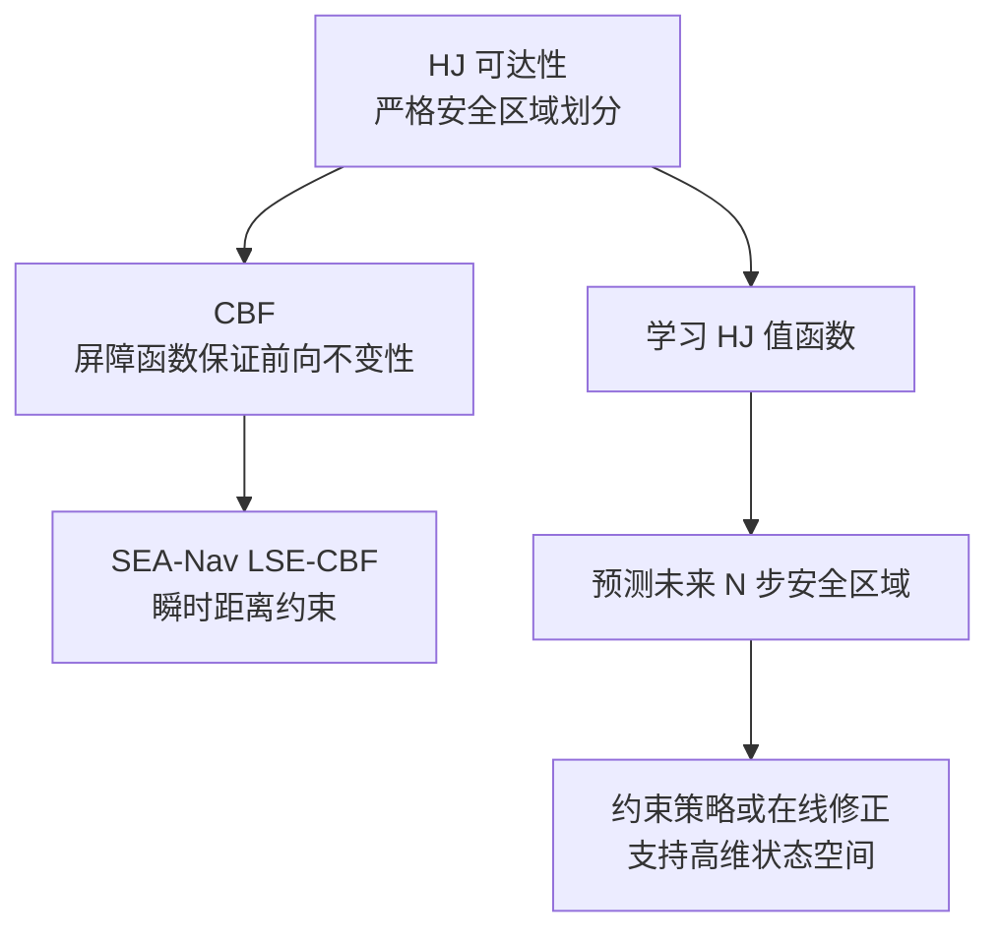

**方法要点：** 从理论上建立了 CBF 与 HJ 可达性的关系——CBF 是 HJ 可达性的一种简化保守近似，是 HJ 的充分条件而非必要条件。传统 HJ 受限于维度灾难（~6D），最新进展通过学习 HJ 值函数扩展到 112 维，使高维 RL 策略的安全验证成为可能。

**创新点：** (1) 提供了完整的安全性理论谱系——从解析 CBF 到学习 HJ；(2) 明确了两种学习范式：在线学习（安全值函数与策略同时训练，如 RESPO NeurIPS 2023）和离线学习（先学安全证书再约束策略）；(3) HJ 可达性天然支持 reach-avoid 任务和**非合作动态障碍物**（不假设障碍物配合避让）；(4) 提供形式化安全保证，而非经验性安全（"训练中没撞过"）。

**对 SEA-Nav 的启发：** 从理论上确认了 LSE-CBF 的局限——只考虑当前时刻。学习 HJ 值函数可作为安全层长期升级方向。动态障碍物可建模为非合作对手，与轨迹驱动设定一致。

---

#### 论文六：DRL Navigation in Crowded Environments — 全面综述与开放问题 (JIRS 2024)

| 作者/机构 | H. Le, S. Saeedvand, C.C. Hsu |
|------|------|

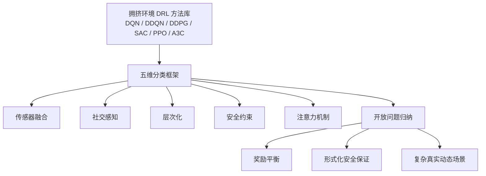

**方法要点：** 覆盖 DQN/DDQN/DDPG/SAC/PPO/A3C 在拥挤环境中的应用，从传感器融合、社交感知、层次化、安全约束、注意力机制五个维度对现有方法进行分类。核心贡献是系统指出了领域的开放问题。

**创新点：** (1) 五维分类框架为方法定位提供了坐标系；(2) 明确指出**五个开放问题**——其中"奖励函数设计：如何平衡安全、效率、平滑性"和"安全性保证：学习策略缺乏形式化安全保证"直接对应本项目的核心挑战；(3) 指出"简单往复运动 ≠ 真实动态场景"，论证了构建复杂场景的必要性。

**对 SEA-Nav 的启发：** 确认"PPO + safety layer"是领域主流范式。两个开放问题分别对应本周的奖励函数优化和安全层升级工作。复杂场景构建的必要性得到了综述层面的论证。

---

#### 论文七：DRL-VO — Velocity Obstacles 引导的强化学习动态避障 (2023)

| 作者 | — |
|------|------|

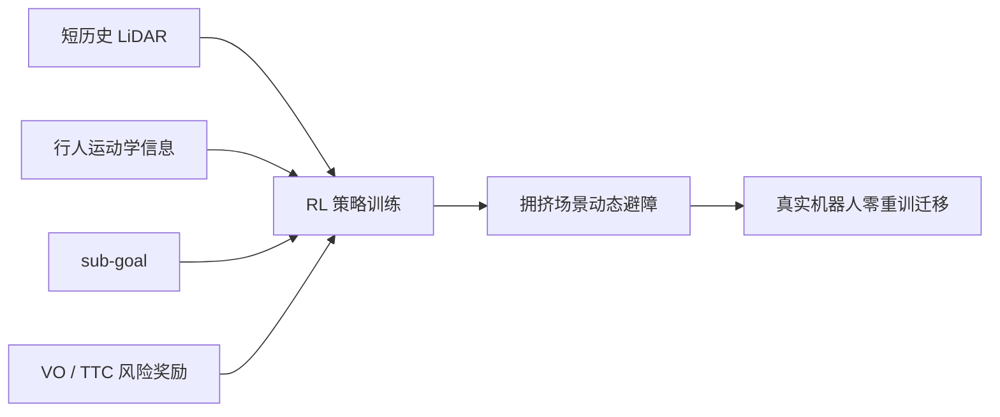

**方法要点：** 用短历史 LiDAR、附近行人运动学信息和 sub-goal 作为输入，在 RL reward 中显式加入 Velocity Obstacle 项——将传统 VO 算法中对碰撞风险的度量转化为奖励信号。实验包含最多 55 个行人的拥挤场景，实现了**真实机器人零重训迁移**（sim 训练后直接在真实机器人上运行，不需要额外 fine-tuning）。

**创新点：** (1) 证明了**结构先验（VO/TTC）融入 RL 奖励比纯黑箱 RL 更有效**——这是将经典几何方法与现代 RL 融合的关键洞察；(2) 验证了 VO 奖励的泛化能力——55 个行人场景未见过的密度下仍有效；(3) 零重训 sim-to-real 迁移——说明 VO/TTC 特征具有足够的物理不变性。

**对 SEA-Nav 的启发：** 最直接的应用参考。将静态碰撞惩罚升级为 VO/TTC 风险奖励——TTC 越小惩罚越大，在碰撞前提供梯度。动态障碍物相对速度应作为观测 token 的一部分。零重训迁移的成功为后续实机部署提供了信心。

---

#### 论文八：Intention-Aware CrowdNav — 预测+注意力图网络 (ICRA 2023)

| 作者 | — |
|------|------|

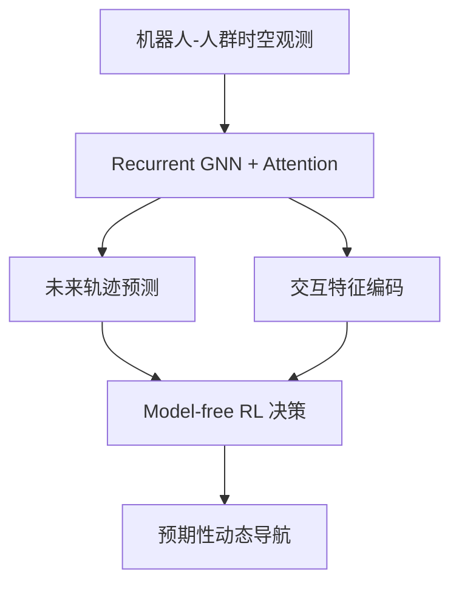

**方法要点：** 用 recurrent graph neural network + attention 建模机器人-人群之间的时空交互，并**预测动态 agent 的未来轨迹**，将预测结果接入 model-free RL，避免机器人闯入他人的预期路径。核心思想是"不仅要看人在哪里，还要预测人将要走到哪里"。

**创新点：** (1) 将轨迹预测与导航决策统一在一个框架中——传统做法是分开的（先预测再规划），本文让预测为决策提供特征；(2) 注意力图网络天然适合建模"机器人-障碍物"和"障碍物-障碍物"的双重交互；(3) 预测信息的融入使策略具有"预期性"——提前绕行而非被动反应。

**对 SEA-Nav 的启发：** 为引入 K 个动态障碍物的图注意力编码器提供了实现参考。可以探索将 dynamic token 接入 GNN encoder，同时建模 Robot↔Obstacle 和 Obstacle↔Obstacle 交互。适合后续社会导航方向扩展。

---

#### 论文九：NavRL — VO 安全层的 PPO 导航 (2024)

| 作者 | — |
|------|------|


**方法要点：** 用 PPO 学习 UAV 在静态与动态障碍中的导航，引入受 Velocity Obstacles 启发的 **safety shield**——RL 策略输出导航决策，安全层在最后兜底，减少神经网络黑箱策略的失败。这是"RL + safety layer"架构在动态环境中的直接验证。

**创新点：** (1) 验证了"RL 负责导航决策 + VO 类安全层负责最后兜底"的双层架构在动态环境中的有效性；(2) safety shield 的设计直接受传统 VO 方法的几何原理启发，具有可解释性；(3) 双层架构比纯端到端策略更安全——即使 RL 策略出错，安全层仍能拦截危险动作。

**对 SEA-Nav 的启发：** 为 SEA-Nav 的"PPO + CBF"路线提供了直接的工程验证——这种架构在动态环境中也被证明有效。后续可考虑增强安全层，使其融合 VO 思想（不仅是距离约束，还有速度约束）。

---

#### 论文十：One Filter — 观测条件化的可达性安全过滤器 (2024)

| 作者 | — |
|------|------|

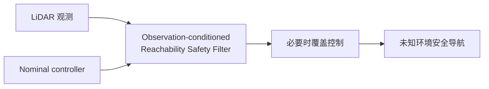

**方法要点：** 提出 **observation-conditioned reachability-based safety filter**——用 LiDAR 输入**动态构造安全区域**，在必要时覆盖 nominal controller。与固定 CBF 不同，安全区域是根据当前 LiDAR 观测实时计算的，因此可以适应未知环境中的动态变化。

**创新点：** (1) observation-conditioned 是相对于 state-conditioned 的重要进步——不需要完整状态信息，直接从原始传感器观测计算安全区域；(2) 适用于不同四足控制器——是一个"即插即用"的安全层；(3) 未知环境中验证——不要求环境地图或障碍物模型已知。

**对 SEA-Nav 的启发：** 适合做 SEA-Nav 安全层的下一阶段升级——将当前 LSE-CBF 升级为以观测（射线+token）为条件的动态安全过滤器。安全裕度不再是全局固定配置，而是根据局部环境实时计算的。

---

#### 论文十一：REASAN — 四足模块化安全导航系统 (2025)

| 作者 | — |
|------|------|

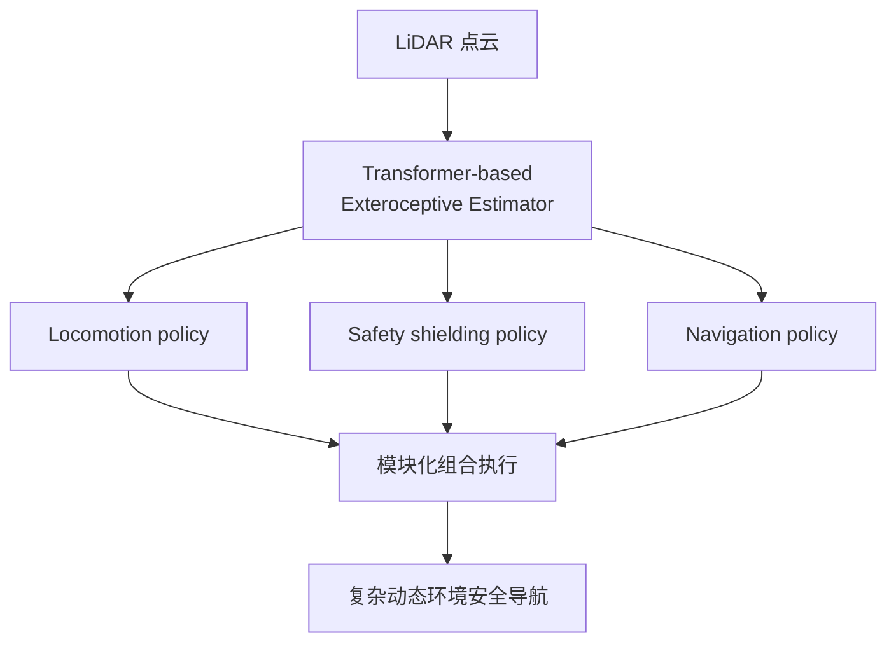

**方法要点：** 面向复杂动态环境的四足反应式安全导航系统，包含 **locomotion + safety shielding + navigation** 三个 RL policy，加上处理 LiDAR 点云的 **transformer-based exteroceptive estimator**。模块化设计将整体导航问题分解为可独立优化和组合的子问题。

**创新点：** (1) 系统级模块化架构——导航策略 + 安全屏障 + 感知估计器，比端到端单一策略更稳定、更可解释；(2) Transformer 感知估计器处理 LiDAR 点云，提供丰富的环境理解；(3) 三个 policy 各自独立训练，组合使用时互不干扰；(4) 证明了模块化在复杂动态场景中的优越性。

**对 SEA-Nav 的启发：** 提供了系统级参考架构。SEA-Nav 当前已具备 navigation（导航策略）和 safety shielding（CBF 安全层），缺少的是显式的感知估计器。后续可参考 REASAN 的模块化设计，将感知、安全、导航三层解耦。

---

#### 论文十二：Omni-Perception — 全向 3D LiDAR 动态避障 (2025)

| 作者 | — |
|------|------|

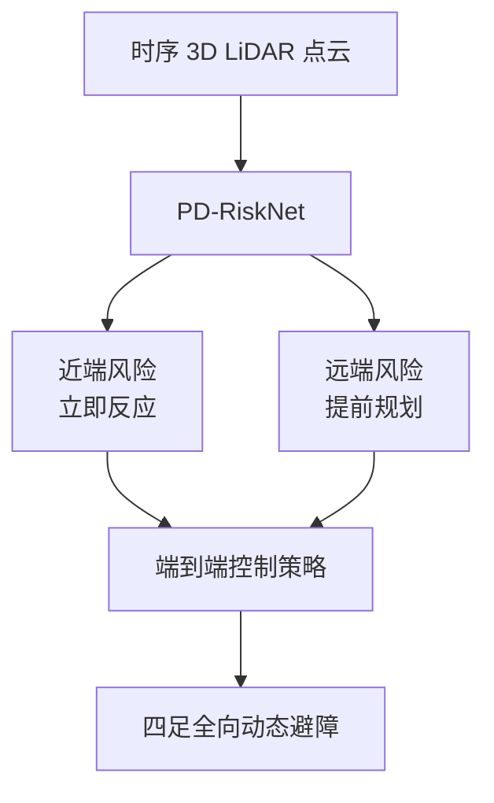

**方法要点：** 用时序 3D LiDAR 点云做端到端四足全向避障，提出 **PD-RiskNet** 分别处理近端风险（需要立即反应）和远端风险（需要提前规划）。支持 Isaac Gym 等仿真平台，将深度学习方法引入 LiDAR 点云的全向动态避障。

**创新点：** (1) PD-RiskNet 的近端/远端风险分离处理——近端风险需要快速反应型策略，远端风险需要规划型策略，分而治之；(2) 从 2D LiDAR 扩展到 3D LiDAR 全向感知——不再局限于水平面扫描；(3) 端到端从点云到控制指令，不依赖显式的物体检测；(4) 支持 Isaac Gym，与 SEA-Nav 仿真栈兼容。

**对 SEA-Nav 的启发：** 后续可从 2D sparse LiDAR 扩展到 3D LiDAR 全向动态避障。近端/远端风险分离的思想可融入当前奖励设计——近端用惩罚压制，远端用引导塑形。

---

### 2.3 方法汇总：四大类别与文献归属

| 方法类别 | 核心思想 | 归属文献 | 与 SEA-Nav 的关系 |
|------|---------|---------|---------|
| **类别一：VO/TTC 引导的强化学习** | 在观测/奖励中显式加入速度障碍和碰撞时间信息，以结构先验增强 RL | DRL-VO, NavRL | 本周已落地——观测中加入 dynamic token (TTC+rel_vel)，奖励中加入 TTC 风险项和 pass-behind 方向奖励 |
| **类别二：CBF / Safety Filter / Reachability** | 策略负责导航效率，安全层负责约束保障；参数自适应或观测条件化 | Online CBF, One Filter, REASAN, NavRL, HJ Reachability Survey | 本周已落地——velocity-aware DynamicTokenCBFLayer；长期可升级为 observation-conditioned safety filter |
| **类别三：Reach-Avoid 值网络 / 恢复策略** | 学习预测未来碰撞风险值函数，高风险时切换恢复策略或修正导航动作 | Agile But Safe, One Filter, HJ Reachability Survey | 预留扩展——RA 值网络可调节 CBF 动态安全裕度；near-miss replay 可为恢复策略提供训练数据 |
| **类别四：图网络 / Transformer / Attention 交互建模** | 显式建模机器人与障碍物间的时空交互关系，区分异质交互类型 | HEIGHT, Intention-Aware CrowdNav, Subgoal-Attention, Omni-Perception | 本周保留接口——dynamic token 结构化语义向量可接 GNN/Attention encoder；射线 Attention 为短期改进 |

### 2.4 交叉验证：12 篇文献的共同指向

```mermaid
flowchart TB
    subgraph C1["观测 + TTC reward"]
        direction TB
        C1A["DRL-VO"] --> C1M["结构先验融入观测与奖励"]
        C1B["NavRL"] --> C1M
        C1C["DRL Survey"] --> C1M
    end

    subgraph C2["动态 CBF / Safety Filter"]
        direction TB
        C2A["Online CBF"] --> C2M["速度感知安全层"]
        C2B["One Filter"] --> C2M
        C2C["REASAN"] --> C2M
        C2D["NavRL"] --> C2M
        C2E["HJ Survey"] --> C2M
        C2F["DRL Survey"] --> C2M
    end

    subgraph C3["学习安全值网络"]
        direction TB
        C3A["Agile But Safe"] --> C3M["未来碰撞风险预测"]
        C3B["One Filter"] --> C3M
        C3C["HJ Survey"] --> C3M
        C3D["DRL Survey"] --> C3M
    end

    subgraph C4["结构化交互编码"]
        direction TB
        C4A["HEIGHT"] --> C4M["GNN / Attention 编码"]
        C4B["CrowdNav"] --> C4M
        C4C["Subgoal-Attention"] --> C4M
        C4D["Omni-Perception"] --> C4M
        C4E["Online CBF"] --> C4M
        C4F["REASAN"] --> C4M
        C4G["DRL Survey"] --> C4M
    end

    C1M --> C5["汇合结论<br/>观测编码运动趋势 + TTC reward"]
    C2M --> C6["汇合结论<br/>动态 CBF / Safety Filter"]
    C3M --> C7["汇合结论<br/>学习安全值网络"]
    C4M --> C8["汇合结论<br/>结构化交互建模"]
```

十二条文献从不同角度汇聚到同一个判断：**动态避障的核心不是仿真中加 moving actor，而是四件事——观测中编码运动趋势、奖励中融入短时碰撞风险、安全层升级为速度感知、策略学会从障碍物后方通过。** 这为 Motion-Aware SEA-Nav 的设计提供了完整的学术支撑。

---

## 三、方法选择与路线设计

### 3.1 四类方法的取舍分析

| 方法类别 | 本周是否采用 | 理由 |
|----------|:---:|------|
| VO/TTC 引导 | ✅ 采用 | 直接增强观测和奖励，改动小，可解释性强 |
| CBF/Safety Filter | ✅ 采用 | 延续 SEA-Nav 已有 LSE-CBF，向 velocity-aware 扩展 |
| Reach-Avoid/Recovery | ⏸ 暂缓 | 需要新增值网络训练，当前基座尚不稳定 |
| GNN/Transformer | ⏸ 暂缓 | 当前障碍物是轨迹驱动的，无真实交互意图，过早引入会增加问题维度 |

### 3.2 确定路线：Motion-Aware SEA-Nav

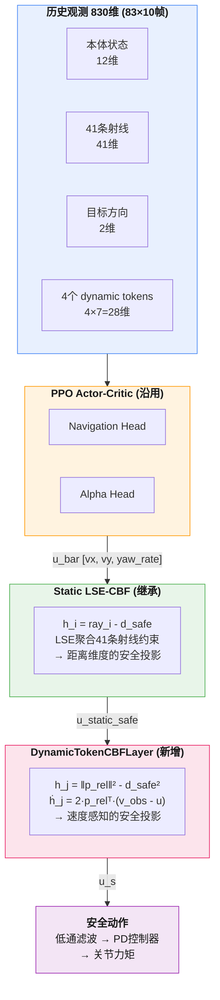

> **蓝色**=观测空间(本周扩展dynamic token)　**橙色**=PPO策略(沿用)　**绿色**=静态CBF(继承)　**粉色**=动态CBF(新增)　**紫色**=输出

### 3.3 路线的学术逻辑

**先做可靠的 motion-aware 基座，再做模块化增强。**

这条路线遵循三个原则：

1. **最小改动原则**：保留原 PPO + LSE-CBF 框架，仅在观测、安全层、奖励三个层面做定向扩展
2. **可诊断原则**：每次只引入一项新机制，通过诊断指标判断作用方向，而非打包式修改
3. **可扩展原则**：dynamic token → 可接 GNN/Attention encoder；velocity-aware CBF → 可升级为 observation-conditioned safety filter；near-miss replay → 可扩展为 recovery policy 训练

---

## 四、系统实现一：复杂动态障碍物环境

### 4.1 从简单到复杂的演进路径

| 阶段 | 环境/任务 | 关键配置 | 目标定位 |
|------|-----------|----------|----------|
| 第二周 | `go2_pos_dynamic_1/2/3` | 1-3 个简单纵向往复障碍物 | 验证系统在基本动态场景下可以训练和避障 |
| 第三周 | `go2_pos_dynamic_complex` | 2-4 个多运动模式动态障碍物 | 从简单动态障碍扩展到复杂动态环境 |
| 第三周 | `go2_pos_dynamic_complex` | 19 个静态障碍物重新布局、均匀分布 | 消除外圈通道，提升场景覆盖度 |
| 第三周 | `go2_pos_dynamic_complex` | 四种运动模式 + episode 预生成轨迹 | 提升动态行为复杂性与可复现性 |
| 第三周 | `go2_pos_dynamic_complex` | 完整训练诊断链路 | 支撑复杂环境下的问题定位与迭代 |

### 4.2 观测空间设计

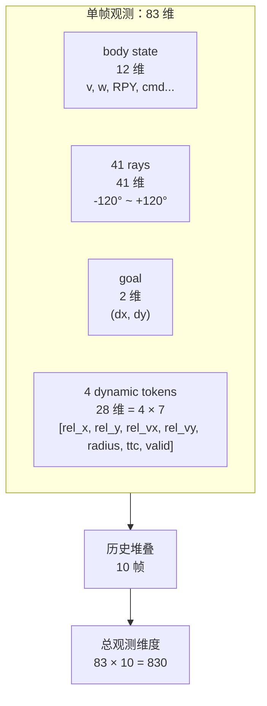

### 4.3 静态障碍物重新布局

**问题**：初始布局中障碍物集中在房间中央，四周形成空旷"外圈通道"，机器人可以绕过复杂区域。

**改进**：19 个障碍物盒子在整个 10m×10m 房间内均匀分布，覆盖下部、中部和上部区域，消除"外圈作弊通道"。

### 4.4 动态障碍物：从在线采样到 episode 预生成轨迹

| 维度 | 在线采样（旧） | episode 预生成（新） |
|------|--------------|-------------------|
| 轨迹生成 | step 中实时采样/反弹 | episode 初始化时一次性生成 |
| 性能瓶颈 | Python 循环、PhysX 接触求解 | 张量索引读取 |
| 运动稳定性 | 存在抖动和重采样 | 轨迹可复现、可检查 |
| 障碍物间碰撞 | 需要重采样处理穿模 | 忽略，仅保证机器人碰撞检测 |
| 运动模式 | 简单线性反弹 | 4 种（crossing, diagonal, circular, figure_eight） |

关键配置：

```python
trajectory_mode = "episode_precomputed"
trajectory_extra_horizon = 0.8
disable_simulation_contacts = True
```

轨迹缓存结构：

```
dynamic_traj_pos  [num_envs, max_obstacles, traj_len, 2]
dynamic_traj_vel  [num_envs, max_obstacles, traj_len, 2]
dynamic_traj_step [num_envs, max_obstacles]
```

---

## 五、系统实现二：网络与安全层

### 5.1 设计决策：为什么不推翻原架构？

面对 SEA-Nav 现有的 PPO + LSE-CBF 框架，设计上有两条路：一是推翻重建，用全新的 Reach-Avoid 值网络或 GNN 编码器替代；二是保留主干，定向扩展。我选择了后者，原因有三个：

| 维度 | 推翻重建 | 保留+扩展（选择） |
|------|---------|-----------------|
| 风险 | 新架构+新环境同时调试，问题来源难区分 | 每次只引入一项新机制，可逐个验证 |
| 继承性 | 需要重新验证静态与动态安全约束的一致性 | 静态 CBF 仍然保护静态避障，动态 CBF 仅补充动态场景 |
| 可解释性 | 新模块的黑箱更难解释行为 | 串行管线每一步都可独立观察和分析 |

**核心工程哲学**：复杂系统中，当基座本身（复杂动态环境）尚未稳定时，不应同时替换上层建筑（网络架构）。

### 5.2 动作处理管线：串行投影的深层原因

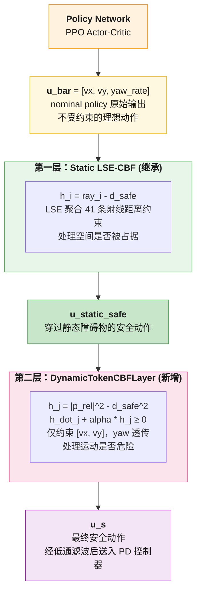

> **橙色**=策略输出　**绿色**=静态CBF(继承)　**粉色**=动态CBF(新增)　**紫色**=最终动作

**为什么是串行（先静态后动态）而非并行？**

| 对比维度 | 串行（先静态 → 后动态）✅ | 并行（同时约束）❌ |
|----------|------------------------|-------------------|
| 语义分工 | 静态CBF处理"空间是否被占据"——位置层硬约束；动态CBF处理"运动是否危险"——速度层软约束，各司其职 | 两个安全层可能对同一动作给出互相矛盾的修正方向，导致投影求解不稳定 |
| 优先级 | 静态碰撞是最高优先级的硬约束，必须先行保证 | 无法区分优先级，动态约束可能与静态约束冲突 |
| 继承性 | 静态安全层作为第一道约束被保留 | 并行约束需要重新处理静态/动态约束冲突和优先级 |
| 可解释性 | 新模块的黑箱更难解释行为 | 串行管线每一步都可独立观察和分析 |

**设计逻辑：** 先保证不撞静态障碍物（位置硬约束），再保证不撞动态障碍物（速度软约束）。两层 CBF 各自独立求解二次规划投影，互不干扰，保证数值稳定性。

**为什么 DynamicTokenCBFLayer 没有可训练参数？**

这是一个有意的设计选择。动态 CBF 使用解析的屏障函数形式——距离平方加上相对速度修正。它不学习任何权重，完全基于物理直觉和几何关系。选择无参数设计的原因：

1. **可解释性**：你总能知道约束为什么收紧（距离变近 or 相对速度变负），不需要解释神经网络的行为
2. **训练稳定性**：没有参数意味着训练早期也不会出现随机的不安全约束——它从第一天就是安全的
3. **与 Online CBF 的区别**：Online CBF 用 GNN 学习 CBF 参数调度，那是更先进的方案，但需要额外的 RL 训练。当前选择是"先用无参数版本跑通基座，后续可以替换为可学习的参数调度器"

### 5.3 Velocity-Aware CBF：从物理直觉到数学形式

**第一步：为什么静态 CBF 的屏障函数 h = ray - d_safe 不够？**

静态 CBF 只编码了一个信息：机器人到障碍物的当前距离。但对于动态障碍物，我们需要知道的不只是"有多远"，还有"相对速度的符号和大小"——双方是在靠近还是在远离、靠近的速度有多快。

**第二步：从距离到距离平方——为什么用二次形式？**

```
静态 CBF：h = r - d_safe             (一阶)
动态 CBF：h = ||p_rel||² - d_safe²   (二阶)
```

选择二次形式 `||p_rel||²` 而非一阶形式 `||p_rel||` 的原因：

- 一阶形式的导数涉及 `1/||p_rel||` 项，在距离趋近于零时有奇异性（梯度爆炸）
- 二次形式的导数 `2·p_rel^T·v_rel` 是平滑的，在所有距离上都定义良好
- `||p_rel||²` 天然是凸函数，保证了 CBF 二次规划有唯一解

**第三步：导数的物理意义——运动趋势编码**

```
dot(h_j) = 2·p_rel^T·(v_obs - u)
         = 2·(相对位置)·(相对速度)
```

这个点积天然编码了运动趋势的四种情况：

| p_rel 方向 | v_rel 方向 | dot(h) 符号 | 物理含义 | CBF 行为 |
|:---:|:---:|:---:|------|------|
| → | → | + | 障碍物远离 | 约束放松 |
| → | ← | − | 障碍物靠近 | 约束收紧 |
| → | ↑ | 0 | 侧向通过 | 约束不变 |
| → | ↓ | 0 | 侧向通过 | 约束不变 |

**第四步：CBF 约束不等式的完整展开**

```
dot(h_j) + alpha·h_j ≥ 0
2·p_rel^T·(v_obs - u) + alpha·(||p_rel||² - d_safe²) ≥ 0
2·(p_rel_x·v_rel_x + p_rel_y·v_rel_y) + alpha·(x_rel² + y_rel² - d_safe²) ≥ 0
```

这是一个关于 u = [vx, vy] 的**线性不等式**——意味着它可以被高效地求解，不需要迭代优化。

### 5.4 安全层的局限：从设计阶段就预见到的问题

在设计 DynamicTokenCBFLayer 时，我就预见到它有三个天然局限：

1. **只约束 [vx, vy]，不约束 yaw_rate**：动态 CBF 只对线速度做安全投影，yaw 保持透传。这意味着如果障碍物很近，策略仍可能原地转向朝向障碍物——这在物理上是安全的（没撞上），但行为上不优雅
2. **没有前瞻性**：CBF 约束只看当前相对位置和速度，不知道障碍物 0.5 秒后的位置。这是 HJ 可达性综述指出的理论局限
3. **可能过度介入**：当障碍物较多时，多个 CBF 约束叠加可能导致安全动作被压缩到零空间附近——机器人几乎不动

这些局限不是 bug，而是有意的简化。每个局限都有对应的后续升级方案（yaw 约束、Reach-Avoid 前瞻、介入率衰减 curriculum），现阶段先让基座跑通。

### 5.5 诊断指标的设计逻辑

新增的 10+ 个指标不是随意加的，它们构成一个**分层诊断体系**：

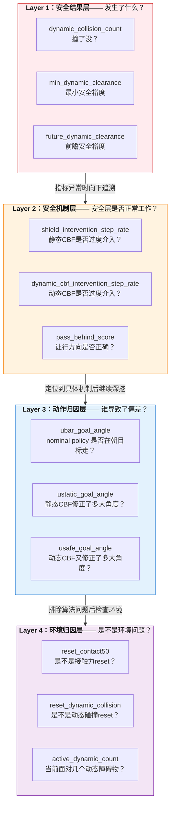

**逐层归因的实例：**

> 如果 `dynamic_collision_count` 高 →
> &emsp;Layer 2：是 CBF 介入不够（intervention_rate 低）还是介入方向不对（pass_behind_score 负）？
> &emsp;&emsp;Layer 3：是 nominal policy 方向偏了（ubar_goal_angle 大）还是 CBF 修正过度（usafe_goal_angle 大但 ubar_goal_angle 小）？
> &emsp;&emsp;&emsp;Layer 4：排除算法问题后，是否是环境 reset 条件误触发？

**设计原则：** 不看最终指标绝对值，按层级链逐层追溯根因——每一个上层异常都可以在下层找到对应的解释变量。

---

## 六、奖励函数设计

### 6.1 核心认知：静态避障与动态避障的奖励设计有本质不同

**静态避障的奖励逻辑**：
```
离障碍物近 = 危险 → 碰撞惩罚 → 策略学会保持距离
```
这个逻辑成立是因为在静态环境中，"距离"是危险的充分统计量。

**动态避障的奖励逻辑**：
```
离障碍物近 + 正在靠近 = 危险 → 需要提前规避
离障碍物近 + 正在远离 = 安全 → 不需要额外干预
离障碍物远 + 快速靠近 = 需要警惕 → 未来可能危险
```
在动态环境中，**距离不再是危险的充分统计量**。同一个距离下，正在靠近和正在远离的障碍物需要完全不同的策略响应。

这就是为什么"只加碰撞惩罚，让 PPO 自己学"是不够的——PPO 的信用分配机制是时序差分的，它很难从最终的碰撞反馈追溯到"三秒前我应该从障碍物后方绕而不是前方"这个具体的行为决策。必须通过奖励塑形把结构化的运动先验注入训练信号。

### 6.2 从视频到奖励：一个完整的诊断-假设-设计-验证闭环

**（1）观察现象（Run 2 model_500 视频）**

人工检查 10 个 episode 的视频，发现两个典型失败模式：

- **失败模式 A**：目标点已经很近（< 2m），机器人绕大圈经过，迟迟不到
- **失败模式 B**：障碍物从右向左运动，机器人也向左躲避，结果在障碍物的未来轨迹上相遇

**（2）提出假设**

- 对模式 A：近目标阶段，goal_progress 奖励的梯度信号太弱——因为此时距离变化很小，progress 本身接近于零。策略在近目标区缺乏行为引导
- 对模式 B：当前奖励只有碰撞惩罚（事后），没有运动方向感知。策略不知道"从障碍物运动方向的后方通过比前方更安全"

**（3）设计奖励**

基于假设，将奖励空间分解为三个正交阶段——阶段之间互不冲突，各自优化各自的行为目标。

**（4）验证（Run 3 model_400）**

Run 3 训练中 iter 400 的 pass_behind_score 转为正值（+0.16），视频中 pass-behind 行为明显改善。假设得到初步验证。

### 6.3 三阶段奖励分解的学理基础

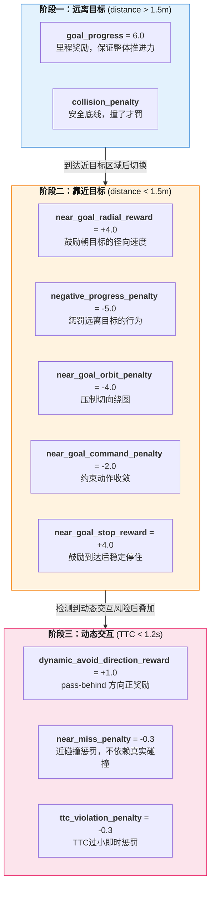

> **蓝色**=里程主导　**橙色**=收敛主导　**粉色**=安全主导

**为什么这样分阶段？**

动态避障有一个本质性的多目标冲突：安全（远离障碍物）和效率（快速到达目标）。如果全局用一个 reward 权重去平衡，要么保守（安全权重高 → freezing），要么激进（效率权重高 → 碰撞）。

分阶段的核心思想是**在不同状态区域激活不同的奖励子集，让每个区域的优化目标更纯粹**：

| 阶段 | 主导目标 | 为什么可以放松其他目标 |
|------|---------|---------------------|
| 远离目标 | 推进效率 | 距离远，碰撞风险低，安全项不需要重激活 |
| 靠近目标 | 行为收敛 | 快到终点了，必须压制绕行和漂移 |
| 动态交互 | 让行方向 | TTC 短说明危险迫近，方向引导比距离惩罚更有效 |

三个阶段不会同时全部激活，减少了梯度信号之间的相互干扰。

### 6.4 近目标五项奖励：从行为分析到数学定义

每一项奖励的提出都源于视频中观察到的具体失败行为，而非凭空设计。

**（1）near_goal_radial_reward = +4.0**

```
radial_vel = dot(robot_vel, unit_vector_to_goal)  # 径向速度分量
reward = 4.0 * max(0, radial_vel)                  # 仅奖励正向径向速度
```

**设计意图**：在目标附近，策略容易做"切向漂移"——在目标外围转圈，径向速度接近零。这个奖励强制策略保持在目标方向上的推进力。

**为什么不奖励负向径向速度的惩罚？** 因为在近目标区域，机器人可能需要小幅后退来调整姿态（比如被 CBF 修正后），惩罚所有后退会让策略无法灵活调整。

**（2）negative_progress_penalty = -5.0**

```
dist_to_goal_current - dist_to_goal_previous > 0  → 正在远离目标
penalty = -5.0                                    → 直接惩罚
```

**设计意图**：针对"到了目标旁边又走出去"的行为。这是视频中观察到的最高频失败模式——机器人到达目标 1m 范围内，然后一个绕行动作又走远了。

**为什么权重设为 -5.0（比 goal_progress +6.0 更重）？** 因为"走过头再回来"的时间代价远大于"慢一点走近"。在数值上，-5.0 的惩罚产生的梯度信号比 +6.0 的奖励更稀疏（只在特定条件下触发），所以需要更大的绝对值来保证梯度强度。

**（3）near_goal_orbit_penalty = -4.0**

```
tangential_vel = ||robot_vel - radial_vel·unit_to_goal||  # 切向速度大小
radial_ratio = radial_vel / (tangential_vel + eps)         # 径向/切向比
penalty = -4.0 * (1 - radial_ratio)  if radial_ratio < threshold
```

**设计意图**：直接量化"绕圈"行为。如果切向速度远大于径向速度（radial_ratio 很小），说明机器人正在目标外围做大幅度的切线运动而不是朝目标走。

**为什么用比值而不是绝对阈值？** 因为不同速度下的"绕圈"表现不同——高速时切向 0.5m/s 可能不算绕圈，但低速时 0.2m/s 的切向速度就已经在画圈了。比值自动适应速度尺度。

**（4）near_goal_command_penalty = -2.0**

```
if ||u_bar|| > max_speed_near_goal:    # 近目标时命令速度过大
    penalty += -2.0
if lateral_component > threshold:       # 近目标时横向命令过大
    penalty += -2.0
```

**设计意图**：从动作命令的根源层面约束行为，而非仅从结果（位置/速度）层面。这直接引导 nominal policy 在近目标时自己输出更保守的命令，减少对 CBF 修正的依赖。

**权重 -2.0 相对较轻的原因**：动作层面的惩罚如果过重，可能导致策略在近目标区域"不敢动"——降低速度到零就安全了，但也到不了目标。

**（5）near_goal_stop_reward = +4.0**

```
if dist_to_goal < tight_threshold and ||robot_vel|| < low_speed and |yaw_rate| < low_turn:
    reward = +4.0  # 持续给停驻奖励
```

**设计意图**：这是五项中唯一一个"正向引导终点行为"的奖励。前四项都在压制不良行为（绕圈、漂移、过快），这一项告诉策略"到了之后稳定停下是好的"。

**关键设计细节——持续给而非一次给**：如果只在到达的那一刻给一次奖励，策略可能学会"碰一下目标区域就走"，而不是真正停下。持续给奖励让策略有动力维持停驻状态。

### 6.5 Pass-Behind 奖励：从直观观察到几何建模

**问题现象的几何分析**：

```
障碍物以速度 v_obs 从右向左运动
机器人位于障碍物右侧

机器人看到: "障碍物在左边 1m" → 往右躲 → 安全！
            但障碍物也在往左走...
            0.5 秒后: 机器人到了右边，障碍物也到了右边 → 撞上！

根本原因: 策略的避障决策只看当前位置 (x, y)，不看运动方向 (vx, vy)
```

**几何建模**：

```
obstacle_direction = v_obs / ||v_obs||     # 障碍物运动方向的单位向量
rel_pos = p_obs - p_robot                  # 障碍物相对于机器人的位置向量
pass_score = dot(rel_pos, obstacle_direction) / ||rel_pos||
           = cos(rel_pos 与 v_obs 的夹角)
```

**几何解释**：

```
pass_score > 0:
  rel_pos 与 v_obs 夹角 < 90°
  → 机器人在障碍物的"后方"（相对于运动方向）
  → 障碍物正在远离机器人的位置
  → 安全 ✓

pass_score < 0:
  rel_pos 与 v_obs 夹角 > 90°
  → 机器人在障碍物的"前方"（相对于运动方向）
  → 障碍物正在靠近机器人的位置
  → 可能撞向未来位置 ✗

pass_score ≈ 0:
  机器人在障碍物的侧方
  → 双方运动方向正交
  → 需要结合 TTC 判断
```

**激活条件的三层过滤**：

1. `TTC < 1.2s`：只在碰撞时间较短时才激活——远距离不需要方向引导
2. `||v_obs|| > 0.05 m/s`：只在障碍物确实在运动时激活——静止障碍物没有"运动方向"
3. `||robot_lateral_vel|| > 0.03 m/s`：只在机器人有侧向运动时才激活——如果它只是在减速/直行，不需要判断"从哪边绕"

**与 DRL-VO 文献中 VO reward 的对比**：

DRL-VO 的 VO reward 是惩罚进入速度障碍锥体的动作。Pass-behind reward 比 VO reward 更轻量——它不需要维护完整的 VO 锥体，只需要一个方向点积。但代价是它没有 VO 的严格几何保证——pass_score > 0 不保证安全（如果障碍物突然转向），它只是一个有利的启发式信号。

### 6.6 CBF 边界对齐：一个容易被忽视的系统性矛盾

**问题的发现过程**：

在分析 Run 2 model_500 的碰撞事件时，我发现有些动态碰撞事件中，机器人既没有特别激进的动作，CBF 也没有报干预——换句话说，CBF 认为安全，但环境判了碰撞。

**根因的数学定位**：

```
环境碰撞判定: distance < 0.65 → collision = True
CBF 约束边界: h_j = ||p_rel||² - (0.32 + 0.20)² = 0
             → 当 distance < 0.52 时约束激活
             → 当 distance ∈ [0.52, 0.65] 时: CBF 已放行，环境尚未判定碰撞
```

在这个 [0.52, 0.65] 区间内，策略被 CBF 告知"安全"，但环境可能在下一步判定碰撞。这就是矛盾信号的来源——策略收到正向梯度（动作被接受），但环境给出负向梯度（发生碰撞）。矛盾信号会让 PPO 的优势函数估计不稳定。

**修复的数学逻辑**：

```
将 safety_margin 从 0.20 提升到 0.35:
CBF 新边界: distance < 0.32 + 0.35 = 0.67
环境碰撞:   distance < 0.65

0.67 > 0.65 → CBF 的约束边界永远在环境碰撞判定之前
             → CBF 永远不会放行一个"马上要碰撞"的动作
             → 消除了 CBF 和环境之间的矛盾信号
```

**0.02 的裕度是精确计算而非随意取的**：

- 裕度太小（如 0.01）：CBF 约束太弱，无法有效改变行为
- 裕度太大（如 0.05）：CBF 可能在安全距离就过度约束，重回 freezing robot 问题
- 0.02 是考虑到 Isaac Gym 的仿真步长（0.02s）和最大相对速度（~0.5m/s），单步最大位移约 0.01m，0.02m 裕度刚好覆盖一个仿真步长的不确定性

---

## 七、训练实验全景

### 7.0 本周实际完成的工程闭环

本周不是单点改动，而是完成了一条可复用的复杂动态避障实验链路：

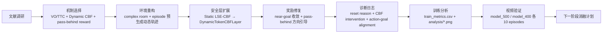

**工作量落点：**

| 模块 | 本周完成内容 | 作用 |
|------|-------------|------|
| 环境 | `go2_pos_dynamic_complex` 多动态障碍 + 19 个静态障碍重新布局 | 构建真正复杂的训练场景 |
| 轨迹 | episode 预生成动态障碍物轨迹 | 解决卡顿、抖动和 PhysX 接触干扰 |
| 观测 | 830 维历史观测 + 4 个 dynamic token | 显式编码相对速度/TTC |
| 安全层 | velocity-aware DynamicTokenCBFLayer | 把 CBF 从静态距离约束扩展到动态速度约束 |
| 奖励 | near-goal 五项奖励 + pass-behind 奖励 | 解决近目标绕远和让行方向错误 |
| 日志 | 新增 10+ 个训练诊断字段 | 支持从结果到机制的逐层归因 |
| 可视化 | 自动生成 success/safety/CBF/direction/reward 图 | 训练后可解释分析 |
| 视频 | `model_500` 与 `model_400` 录像 | 人工验证曲线外的真实行为 |

### 7.1 三次训练 Run 对照

| 维度 | Run 1 | Run 2 | Run 3 |
|------|-------|-------|-------|
| **时间** | 06-20 05:14 | 06-20 07:23 | 06-21 04:28 |
| **环境数** | 64 | 64 | 128 |
| **难度** | Hard complex (初始) | Easy complex | Easy complex (+ 新奖励) |
| **动态障碍** | 6-10, fast | 2-4, slow | 2-4, slow |
| **训练迭代** | 500 | 500 | 500 |
| **最终 success** | 0.00 | 0.29 | 0.54 (最佳 0.90) |
| **episode length** | ~9 step | ~854 step | ~745 step (最佳) |
| **核心问题** | contact 误触发 → 无效样本 | 近目标绕远 | 后段退化 |
| **状态** | ❌ 失败 | ⚠️ 不稳定 | ⚠️ 有潜力，需稳定 |

### 7.2 Run 3 训练过程详细数据

| 窗口 | success | safe_success | dyn_coll | body_coll | pass_behind | TTG (s) |
|------|:---:|:---:|:---:|:---:|:---:|:---:|
| iter 200 | 0.6875 | 0.6875 | 0.1042 | 0.1875 | — | — |
| **iter 400 (model_400)** | **0.8958** | **0.8958** | **0.0208** | **0.0833** | **+0.1614** | **16.30** |
| iter 490 (final) | 0.5417 | 0.2083 | 0.4583 | 0.8542 | -0.1172 | — |

**关键发现：训练最佳窗口不在最后，而在 iter 400 附近。后段出现退化。**

### 7.3 训练曲线证据：主图与诊断图

> 以下图片均来自 `training/legged_gym/logs/Go2_pos_dynamic_complex/06_21_04-28-54_/analysis/`，可以直接用于投屏。建议主讲前三张，后两张作为诊断补充或 Q&A 备用。

#### 图 1：成功率与安全成功率曲线


**图示解读：**

- success 从训练初期接近 0 上升到 0.8 以上，说明奖励函数和环境重构后，策略确实学到了可用导航行为。
- safe_success 在 2.4M timesteps 附近达到高点，之后明显回落，说明不是“训练越久越好”，必须做 checkpoint selection。
- timeout 后期接近 0，说明失败主要不是“走不动超时”，而是安全性和接触问题。

#### 图 2：动态让行方向与未来安全裕度


**图示解读：**

- `pass_behind_score` 在 model_400 附近转为正值，对应训练表中 `+0.1614`，说明 dynamic_avoid_direction_reward 对横穿障碍让行方向有正向作用。
- 训练后段 pass-behind 又回落到负值附近，对应最终 safe_success 下降，说明该奖励方向有效但还不稳定。
- `future_dynamic_clearance` 和 `min_dynamic_clearance` 在中后段整体抬升，说明 CBF 边界对齐和动态奖励提升了动态安全裕度。

#### 图 3：碰撞与 near-miss 事件


**图示解读：**

- dynamic collision 在中后段有下降窗口，model_400 附近动态碰撞降到约 0.0208。
- body collision 与 total collision 后段又出现反弹，解释了为什么 final checkpoint 不如 model_400。
- near-miss 长期存在，说明策略仍频繁进入危险邻域，下一阶段不能只看 collision，还要围绕 near-miss replay 和 TTC 风险继续优化。

#### 诊断补充图 4：CBF 介入率


**图示解读：**

- `shield_intervention_step_rate` 长期接近 1.0，说明静态安全层几乎每步都在修正动作。
- `dynamic_cbf_intervention_step_rate` 约在 0.24-0.63 之间波动，说明动态 CBF 并非完全接管，而是在动态风险阶段发挥作用。
- 后续要解决 nominal policy 对 CBF 的依赖，不能让安全层长期替 policy 做决策。

#### 诊断补充图 5：动作-目标方向对齐


**图示解读：**

- `u_bar_goal_angle`、`u_static_goal_angle`、`u_safe_goal_angle` 三条曲线整体同步下降，说明 policy 输出和安全层修正后的动作都逐步更接近目标方向。
- 三者之间差距不大，说明很多阶段不是 CBF 单独把动作改坏，而是 nominal policy 本身仍有方向偏差。
- 该图支撑下一阶段的诊断思路：区分“policy 学偏”与“CBF 修正过强”。

---

## 八、排错过程深度分析

### 8.1 五个关键问题的发现-诊断-修复链

| 问题 | 现象 | 诊断 | 修复 | 效果 |
|------|------|------|------|------|
| 问题1：训练过慢 | 64 env 训练明显卡顿 | 在线采样中逐 env 逐 slot 的 Python 循环 + PhysX 接触求解 | episode 预生成轨迹 + 张量索引更新 + `disable_simulation_contacts` | 32 env / 200 step 正常运行，不再卡在初始化/推进循环 |
| 问题2：动态障碍物原地抖动 | 录像中障碍物几乎不运动，只在原地抖动 | PhysX 接触求解干扰 + 在线反弹逻辑反复触发 | 完全由预生成轨迹驱动，inactive slot 统一放远处 | 录像中可观察到平滑的四种运动模式 |
| 问题3：`success = 0` | 500 iterations 后 `success_rate = 0`, `timeout_rate = 0` | `mean_episode_length ≈ 9 step`, `mean_duration ≈ 0.17s`，说明不是走不动，而是刚开始就被 reset；根因是 `contact_force > 50` 对所有刚体检查，足端落地/摩擦/初始化冲击也可能触发 | 收窄到 `termination_contact_indices`（base/head 等危险部位）+ `hard_contact_warmup_steps = 10` | 16 env / 30 step 冒烟测试：`first_step_dones=0`, `contact50=0` |
| 问题4：CBF 边界与碰撞阈值不一致 | 策略被 CBF 放行但仍发生动态碰撞 | CBF 安全距离 `0.32 + 0.20 = 0.52 < 0.65` 碰撞阈值 | `safety_margin 0.20 → 0.35`，实际安全距离 `0.67 > 0.65` | 消除了 CBF 与环境的矛盾信号 |
| 问题5：Isaac Gym 退出 segfault | 训练/评估结束后 Segmentation fault | checkpoint 已保存、`metrics.csv` 已写出、`torch.load` 可读，判断为 Isaac Gym 析构/清理阶段问题 | 记录问题，不作为当前训练阻塞项 | 不影响训练结果使用 |

### 8.2 方法论启示

**不能只看最终 success_rate，必须看诊断指标链：**

```mermaid
flowchart TD
    M1["success = 0"] --> M2["mean_episode_length 是多少？"]
    M2 --> M3{"是否极短<br/>&lt; 20 step"}
    M3 -- 是 --> M4["reset 太频繁"]
    M4 --> M5["检查 reset reason"]
    M5 --> M6{"collision / contact / timeout ?"}
    M6 --> M7["Run 1: contact_force 误触发"]
    M3 -- 否 --> M8["继续检查奖励 / 安全层 / 策略行为"]
```

这是本周最重要的工程方法论收获：**复杂 RL 任务中，诊断指标是把"训练失败"转化为"可解释问题"的前提。**

---

## 九、结果分析与策略行为诊断

### 9.1 model_500（奖励优化前）视频诊断

```
model_500 固定评估 (40 episodes):
  success_rate:       0.4000
  safe_success_rate:  0.2750
  dyn_collision:      0.3250
  body_collision:     0.7000

视频中暴露的典型问题:
  1. 目标点已经很近，但机器人绕了较大远路
     → 近目标阶段缺少收敛约束
  2. 动态障碍物从右向左运动，机器人仍向左侧躲避
     → 缺乏 pass-behind 方向性引导
     → 仅按当前距离避障，不考虑障碍物未来位置
```

### 9.2 model_400（奖励优化后）改进分析

```
model_400 训练窗口 (iteration 400):
  success:             0.8958
  safe_success:        0.8958
  dyn_collision_count: 0.0208
  body_collision:      0.0833
  pass_behind_score:  +0.1614  (正值！)
  time_to_goal:       16.30 s

10 episode 录像:
  成功 6 / 失败 4
  动态碰撞仅出现在第 4 个 episode
```

> 注意：这里是训练窗口指标，不是严格固定评估。它说明 reward 方向和 checkpoint 选择有价值，但下一步仍必须跑 `50 episodes` 固定评估。

### 9.3 两个残留问题

**问题一：训练后段退化**

```
iter 400: success=0.90, pass_behind=+0.16
iter 490: success=0.54, pass_behind=-0.12

可能原因：
  - 多个奖励项之间存在竞争
  - 策略被近目标奖励牵引，同时受动态避障、安全层修正、探索噪声影响
  - 后期从较优行为漂移出去
```

**问题二：安全层依赖**

```
shield_intervention_step_rate ≈ 0.99
```

这意味着 99% 的时间步中静态 CBF 都在修正 nominal action。实际执行的动作大量来自安全层修正，而非 policy 自己学会了安全动作。长期而言会导致：

- 到达效率低（安全层只保证安全，不保证效率）
- 目标附近绕远（目标推进可能被安全修正和局部障碍约束压制）
- 动态让行方向不稳定（CBF 不知道从哪边绕）

### 9.4 诊断指标的价值验证

```
ubar_goal_angle vs usafe_goal_angle:
  - 如果 u_bar 偏离目标方向: nominal policy 学偏了 → 改 reward
  - 如果 u_bar 正常但 u_s 偏离: CBF 修正过强/不合理 → 调 CBF 参数

pass_behind_score:
  - 正值 → 策略倾向于从后方通过（安全）
  - 负值 → 策略抢到障碍物前方（危险）
  - Run 3: iter 400 正值 → iter 490 负值 → 奖励方向对，但退化需要解决
```

---

## 十、阶段性认识与下一步计划

### 10.1 四个阶段性认识

**认知一：动态避障的关键不是"障碍物会动"，而是"策略理解运动趋势"**

仅有 moving actor 不够。真正关键的是：观测中的相对速度、奖励中的短时碰撞风险、安全层的速度感知、策略的 pass-behind 行为。

**认知二：安全层既是优势，也可能造成训练偏差**

SEA-Nav 的 CBF 让策略在训练早期不至于大量撞障碍，这是一个很强的优势。但当 `shield_intervention_rate ≈ 0.99` 时，策略可能形成对安全层的依赖——到达效率低、目标附近绕远、让行方向不稳定。后续需要让 nominal policy 学会提出更接近安全动作的命令。

**认知三：工程诊断指标是把失败变成可解释问题的前提**

第一次 success=0 的训练，如果只看最终指标会误判为算法失败。通过新增 reset reason 指标，才发现是 contact reset 误触发导致 episode 极短。对于复杂 RL 系统，`episode_length`、`reset_reason`、`collision_type`、`intervention_rate` 等诊断指标和最终成功率一样重要。

**认知四：当前路线具有可解释的后续扩展空间**

本周没有引入 GNN、Transformer 或 Reach-Avoid value network，但 dynamic token 可以接 attention encoder，near-miss replay 可以扩展为 recovery policy 训练，velocity-aware CBF 可以升级为 observation-conditioned safety filter。当前工作是工程基座，也是后续研究路线的起点。

### 10.2 本周研究思维闭环

| 阶段 | 问题 | 方法 | 证据 | 下一步 |
|------|------|------|------|--------|
| 文献归纳 | 动态避障到底缺什么？ | 归纳 VO/TTC、CBF、RA、GNN 四类机制 | 12 篇文献共同指向 motion-aware | 选择可落地机制 |
| 机制选择 | 不能一次性堆大模型 | 保留 PPO+CBF，新增 token/动态 CBF/reward | 观测维度保持 830，接口稳定 | 后续再接 GNN/RA |
| 环境诊断 | success=0 是算法失败吗？ | 加 reset reason、episode length | mean episode length 约 9 step | 修 contact reset |
| 行为诊断 | model_500 为什么视频差？ | 人工看视频，抽象失败模式 | 近目标绕远、横穿障碍抢前方 | 设计 near-goal/pass-behind reward |
| 验证 | reward 方向是否有效？ | 128 env / 500 iter 训练 + 图表 + 视频 | model_400 窗口显著提升 | 固定评估与消融 |
| 反思 | 为什么 final 又退化？ | 对比 iter 400 vs 490 | safe_success 回落、pass_behind 变负 | 稳定训练、checkpoint selection |

**核心观点：** 本周不是简单调参，而是把每个现象转化为可检验假设，再用日志、图表和视频验证假设。

### 10.3 下一步八步计划

| 步骤 | 任务 | 执行动作 | 关注指标 / 目标 |
|------|------|----------|-----------------|
| A0 | 固定评估 `model_300/400/500` | 每个 checkpoint 跑 50 episodes | 确认真实最佳 checkpoint；重点看 `safe_success`、`pass_behind`、`dynamic_collision` |
| A1 | 复现验证 | 最佳配置跑 3 个随机种子 | 确认 `model_400` 优势是否可复现 |
| A2 | 近目标奖励消融 | 每次只动一个权重 | 观察近目标绕远是否下降 |
| A3 | `pass-behind` 奖励消融 | 每次只动一个权重 | 观察横穿障碍让行方向是否改善 |
| A4 | 训练稳定性优化 | 降低后半程学习率 / 保存更密集 checkpoint | 解决后段退化问题 |
| A5 | Easy complex 固定评估对比 | 在达到验收条件后开展正式对比 | `safe_success ≥ 0.45`，`dyn_collision ≤ 0.25` |
| A6 | 开启 near-miss replay | 从 `collision-state replay` 扩展到 `TTC-based near-miss replay` | 提升危险邻域样本利用率 |
| A7 | 进入 Medium curriculum | near-miss replay 稳定后切换到 3-5 个动态障碍物 + 中等速度 | 逐步提升场景难度 |
| A8 | 长期研究扩展 | 引入 `GNN/Attention encoder`、`Reach-Avoid value network`、`observation-conditioned safety filter` | 形成下一阶段研究路线 |

### 10.4 验收标准

| 阶段 | 指标 | 目标值 |
|------|------|--------|
| Easy complex 固定评估 | safe_success_rate | ≥ 0.45 |
| | avg_dynamic_collision_count | ≤ 0.25 |
| | avg_body_collision_count | ≤ 0.50 |
| | 视频表现 | 不再频繁近目标大绕行 |
| Medium complex | success_rate | ≥ 0.35 |
| | pass_behind_score | 稳定正值 |

---

## 附录：本周产物汇总

### 文档
- `docs/dynamic_obstacle_literature_review_v1.md` — 6 篇论文精读 + 9 项改进方案
- `docs/dynamic_obstacle_literature_review_v2.md` — 补充 6 篇文献 + 研究切入点设计
- `docs/dynamic_complex_quick_validate_report.md` — 复杂环境快速验证报告
- `docs/motion_aware_dynamic_complex_validate_report.md` — Motion-Aware 验证报告
- `docs/week3report.md` — 本周完整工作记录

### 代码修改（主要文件）
- `legged_robot_pos_dynamic.py` — 复杂动态环境核心逻辑
- `go2_pos_config.py` — 复杂任务配置、奖励函数、终止条件
- `cbf_lse_layer.py` — DynamicTokenCBFLayer
- `cbf_actor_critic.py` — 动作管线修改
- `on_policy_runner.py` — 新增日志指标
- `evaluate_dynamic.py`, `play_record.py` — 评估与录像脚本

### 训练产物
- Run 1: `logs/Go2_pos_dynamic_complex/06_20_05-14-50_` ❌
- Run 2: `logs/Go2_pos_dynamic_complex/06_20_07-23-45_` ⚠️ model_500
- Run 3: `logs/Go2_pos_dynamic_complex/06_21_04-28-54_` ⚠️ model_400 + analysis

### 视频
- `exported/06_20_07-23-45_model_500.mp4` (128 MB, 10 episodes)
- `exported/06_21_04-28-54_model_400.mp4` (193 MB, 10 episodes)
