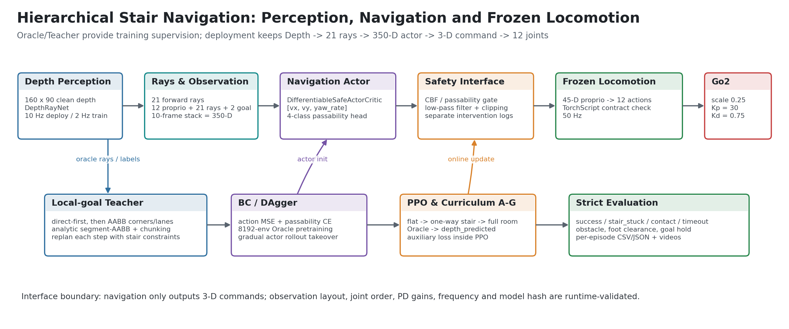
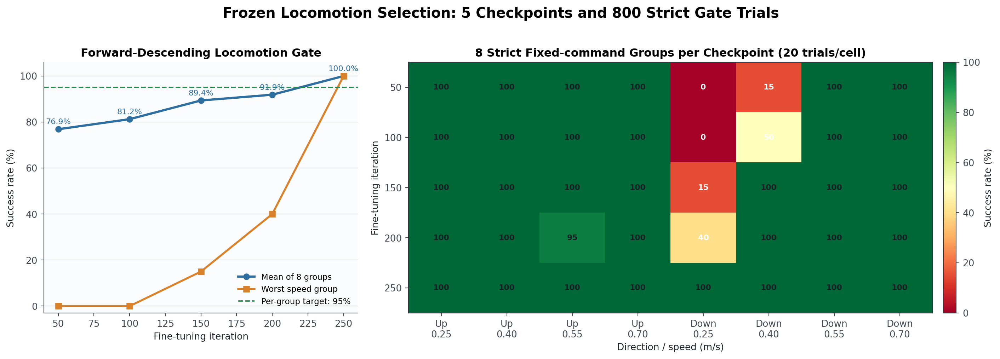
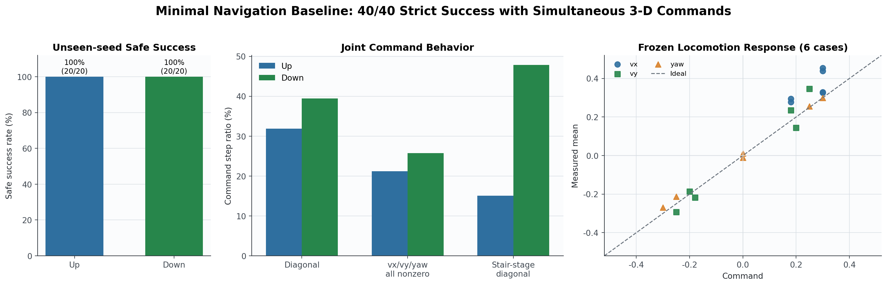
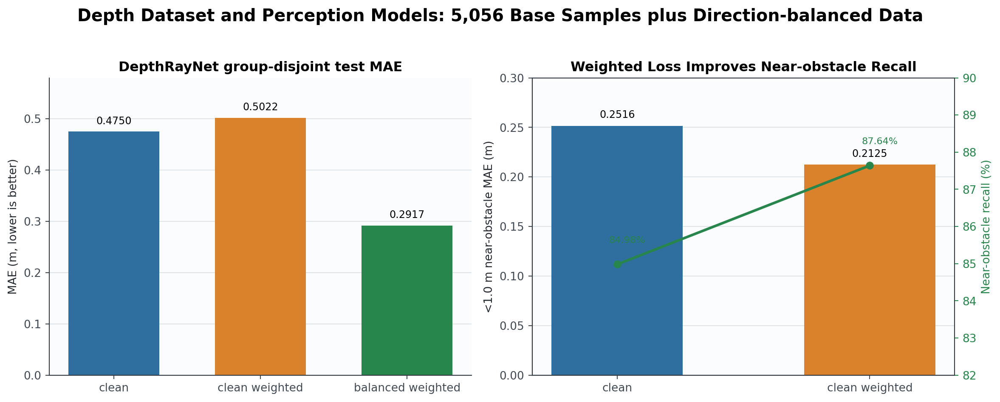
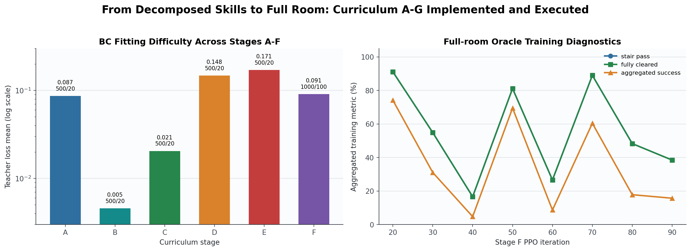
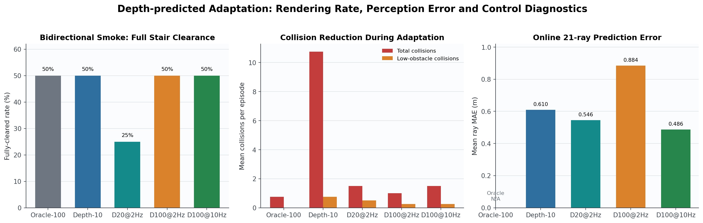
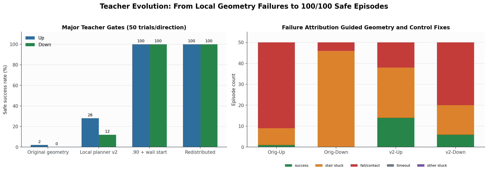
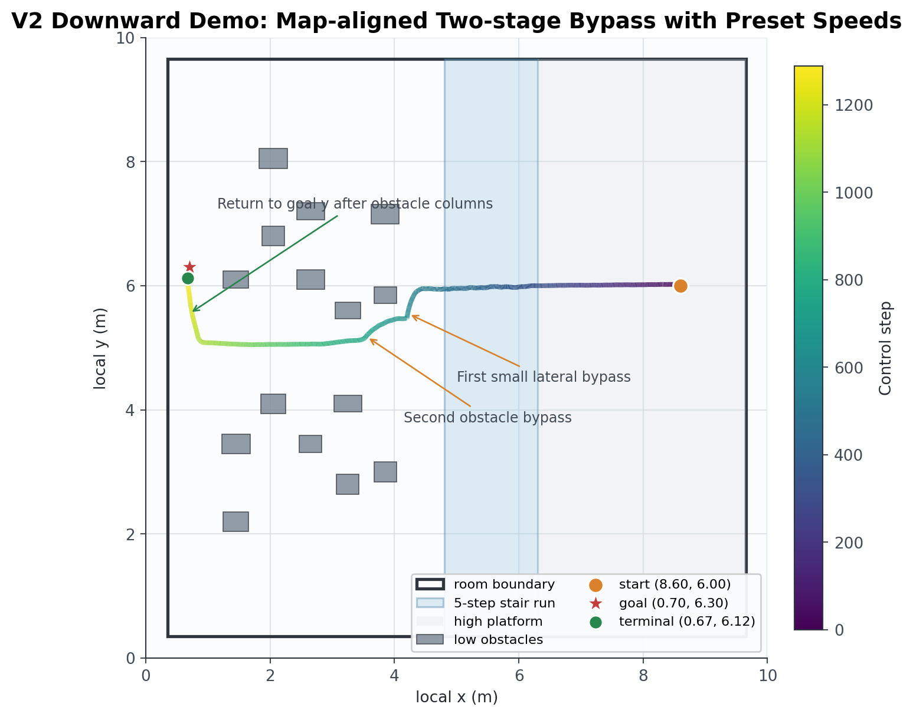

# 周报：面向复杂房间的四足机器人双向楼梯导航

> 汇报周期：2026-07-27 -- 2026-08-02  
> 项目：SEA-Nav / Go2 楼梯与低矮障碍物导航  
> 本周主线：从底层盲式 locomotion 训练、冻结与接口验证，逐步完成上层导航、Depth Sensor 感知、局部 Teacher、BC/DAgger、PPO 课程和可视化诊断闭环。

## 1. 本周工作概览

本周不是单独训练一个策略，而是完成了一条可拆分、可验证、可替换的分层导航链路：上层只负责输出三维速度命令，底层负责把命令转换为 12 个关节动作；上层感知又被拆成真实深度图、21 条导航射线和 350 维时序观测。这样可以分别定位“看不准、规划不对、上层动作退化、底层无法执行、终止规则误判”等问题。

| 层级 | 本周完成内容 | 代表性结果 |
|---|---|---|
| 底层 locomotion | 从既有 iteration 2800 权重做头朝前下楼微调；建立 45→12 TorchScript 契约和 8 组严格 gate | model 250 在上下行 × 4 个速度上取得 `160/160`；目标房间固定 `0.40 m/s` 上下楼均完全离阶 |
| 最简上层导航 | 保留 SEA 350 维接口，加入固定地图 A*、局部航点、BC/DAgger、严格逐回合评估 | 未见 seed 上行 `20/20`、下行 `20/20`，低障碍和墙体碰撞均为 0 |
| 深度感知 | 采集 `160×90` clean depth 与 21-ray 标签；实现 ResNet-18 DepthRayNet、分组隔离、加权近障碍损失 | 基础集 5056 样本；方向平衡模型 test MAE `0.2917 m`；加权模型近障碍召回率提升到 `87.64%` |
| 上层导航框架 | 新增 `go2_pos_depth_stairs_passability`、局部 Teacher、四分类通过性头、PPO 辅助损失和课程 A--G | 8192-env Oracle/BC/PPO 链路与 1024-env depth-predicted 链路均已实际跑通 |
| Teacher 与控制诊断 | 解析线段-AABB、GPU 分块、候选通道、航点滞回、楼梯阶段控制、航向闭环、严格终止原因 | 当前再分布房间 Teacher 上下行分别 `50/50` 安全成功 |
| 可视化与复现 | 逐回合 CSV/JSON、固定 seed 视频、终端标注、轨迹地图和周报图表 | 已保留 27 段 Depth Teacher 视频；最新 V2 下行视频为 `960×540 @ 30 Hz`、terminal `success` |



图 1 展示了当前代码实际采用的边界。训练时可以用 Oracle 射线和 Teacher 监督，部署侧仍保持 `Depth -> 21 rays -> 350-D actor -> 3-D command -> frozen locomotion -> 12 joints`，不会把已知地图直接输入最终 actor。

## 2. 底层 locomotion：先保证速度命令能稳定执行

### 2.1 为什么先重做底层

上层导航无论采用 A*、Teacher 还是 PPO，最终只能发送 `[vx, vy, yaw_rate]`。如果冻结低层不能头朝前下楼、不能响应横向速度，或者训练和部署时关节顺序不一致，上层的任何路径规划都会被执行误差掩盖。因此本周先把 locomotion 作为独立产品验收，再冻结给上层使用。

本周建立了两个低层任务：

- `go2_blind_stair_loco`：盲式本体感知速度跟踪任务；
- `go2_blind_stair_loco_forward_finetune`：从既有 locomotion 权重继续做头朝前正向下楼微调。

低层 actor 的单帧观测固定为 45 维：

```text
3 base angular velocity
+ 3 projected gravity
+ 3 velocity command
+ 12 joint position error
+ 12 joint velocity
+ 12 last action
= 45 dimensions
```

actor 输出 12 维关节位置增量，控制参数固定为 `50 Hz`、action scale `0.25`、`Kp=30`、`Kd=0.75`。上、下行都发送机体系正向 `vx>0`；下行通过初始 yaw=`pi` 让机器人机头朝向下楼方向，而不是通过负 `vx` 倒退下楼。

### 2.2 训练与模型契约

本周新增的 [low_level.py](../training/legged_gym/legged_gym/low_level.py) 将训练和部署共同依赖的约束集中起来：

1. 明确 45 维观测项及其起止索引；
2. 明确 Go2 12 个外部关节顺序及 Isaac Gym 内部顺序的重排；
3. 导出 TorchScript 时同时生成 JSON metadata；
4. 运行时逐项检查输入/输出维度、观测缩放、默认角、关节顺序、PD 参数、控制频率和模型 SHA256；
5. 任一契约不一致就拒绝加载，而不是让错误模型继续运行。

正式微调从原始 model 2800 开始，学习率使用 `1e-4`，每 50 iterations 导出一次 TorchScript 并执行 8 组固定命令 gate：上/下行各 `0.25/0.40/0.55/0.70 m/s`，每组 20 回合。最终选用：

```text
training/legged_gym/logs/Go2_blind_stair_loco_forward_finetune/
branches/from_2800_forward_lr1e4_0731a/exports/blind_stair_loco_iter_0250.pt
```



图 2 反映了微调的实际作用：iteration 50 时上行已经稳定，但下行低速 `0.25/0.40 m/s` 分别只有 `0/20` 和 `3/20`；随着继续微调，最弱速度组从 0% 提升到 100%，model 250 最终 8 组全部 `20/20`。5 个 checkpoint 共执行了 800 个严格 gate 回合。

### 2.3 冻结后在目标房间内复核

为了区分“训练台阶上可用”和“接入上层环境后可用”，又绕过上层策略直接进行了两类探针：

- 固定命令探针：上行 `6.82 s`、下行 `6.46 s` 完全离阶；低障碍和墙体碰撞均为 0；下行最小航向对齐为 `0.9523`；
- 全向命令探针：6 组 `[vx, vy, yaw_rate]` 联合命令的响应方向全部正确，零低障碍/墙体碰撞，说明底层支持同时前进、侧移和转向。

对应证据为 [fixed locomotion summary](../training/legged_gym/logs/Go2_pos_stairs_minimal/fixed_locomotion_probe_model250/summary.json) 和 [omnidirectional summary](../training/legged_gym/logs/Go2_pos_stairs_minimal/omnidirectional_locomotion_probe_model250/summary.json)。

## 3. 最简上层导航：先验证分层接口与闭环控制

### 3.1 350 维上层接口

在 [go2_pos_stairs_minimal](../training/legged_gym/legged_gym/envs/go2/go2_stairs_minimal_config.py) 中，上层保持 SEA 原有 350 维接口：

```text
(12 维本体状态 + 21 条射线 + 2 维局部目标) × 10 帧 = 350 维
350-D actor -> [vx, vy, yaw_rate]
3-D command -> frozen 45-D locomotion actor -> 12 joint actions
```

这一阶段不创建相机，21 条射线由房间墙体和低障碍 AABB 直接计算，目的是隔离验证上层 actor、低层执行器、场景碰撞和严格终止规则是否能够闭环。

### 3.2 已知地图 Teacher 与 BC/DAgger

最简基线先用固定地图 A* 获得可行路径，再做可见性简化；actor 看到的 2 维目标项不是最终目标，而是当前局部航点。楼梯入口和出口横向错开 `0.30 m`，让数据中出现轻微斜向楼梯命令，同时保持机头朝前。

训练上做了两类尝试：

- BC/DAgger：动作 MSE 拟合 Teacher，并逐渐提高 actor 自己驱动环境的比例，减少纯 Teacher 状态分布偏差；
- PPO 接续：早期实验发现 PPO 容易破坏已经收敛的 BC 行为，因此当前基线采用“继续增加 Teacher 拟合步数 + 独立 seed 评估”的更稳定流程。

最终上层 checkpoint 为：

```text
training/legged_gym/logs/Go2_pos_stairs_minimal/
08_01_03-34-44_/model_teacher_pretrained.pt
```



图 3 左侧是上、下行各 20 个未见 seed 的严格结果，均为 `20/20`；中间给出了 actor 的联合命令行为，下行斜向命令占 `39.5%`、三维同时非零占 `25.7%`、台阶段斜向命令占 `47.9%`；右侧是冻结低层对 6 组三维联合命令的实测响应。这两组证据共同说明，上层确实在输出联合控制，而不是由低层限制导致的“先横移、再前进”。

逐回合结果见 [eval_unseen_20x20.json](../training/legged_gym/logs/Go2_pos_stairs_minimal/08_01_03-34-44_/eval_unseen_20x20.json)。所有成功回合都满足低障碍碰撞为 0、楼梯通过、四足完全离阶、进入障碍区且没有绕房间边缘。

## 4. 从几何射线升级到真实 Depth Sensor

### 4.1 数据链路

最终目标不允许把固定地图 AABB 当作部署输入，因此新增了 `go2_pos_depth_stairs_passability`：

```text
160×90 clean depth
    -> log2 depth
    -> single-channel ResNet-18 DepthRayNet
    -> 21 log2 ray distances
    -> exp2 + [0.1, 5.0] m clipping
    -> 350-D navigation observation
```

采集器为每一帧同时保存真实相机深度和 Oracle 21-ray 标签。本周主要完成：

- 64 个环境、2000 步 clean depth 采集，得到 5056 个有效样本、978 个 episode groups；
- 丢弃初始全 5 m 帧和未更新的重复帧；
- group ID 改为 `episode_seed*2 + direction_bit`，避免上下行 seed 重叠；
- train/val/test 按 episode group 隔离，不让同一回合的相邻帧跨集合；
- 输入做水平翻转时，21 条射线标签同步翻转；
- 使用 log2 空间 MSE，并对近障碍与“把近障碍预测得过远”的错误加权。

### 4.2 感知模型对比



图 4 汇总三轮主要感知实验。普通 clean 模型整体 test MAE 为 `0.4750 m`；近障碍加权模型整体 MAE略升至 `0.5022 m`，但 `<1.0 m` 的近障碍 MAE 从 `0.2516` 降到 `0.2125 m`、召回率从 `84.98%` 升到 `87.64%`。补充上下行方向平衡数据后，group-disjoint test MAE 进一步降到 `0.2917 m`。

当前保存了三套可复用权重：

- `stairs_clean_best.pt`；
- `stairs_clean_weighted_best.pt`；
- `stairs_balanced_weighted_best.pt`。

对应实现位于 [depth_ray.py](../training/legged_gym/legged_gym/depth_ray.py)、[collect_depth_stairs.py](../training/legged_gym/legged_gym/scripts/collect_depth_stairs.py) 和 [train_depth_rays.py](../training/legged_gym/legged_gym/scripts/train_depth_rays.py)。

## 5. 上层导航框架：Teacher、通过性辅助头与 PPO

### 5.1 局部直达优先 Teacher

最初的固定 A* 路线容易让机器人按模板先横移到某条通道，再开始向目标前进。Depth 主线改为局部、目标驱动的 Teacher：

1. 每个控制步先检测当前位置到目标的直线段；
2. 若直达线无阻挡，航点就是目标；
3. 若有阻挡，从障碍膨胀 AABB 角点、前向通道和局部 lattice 中选择安全候选；
4. 使用“当前位置到候选 + 候选到目标”的代价选择局部航点；
5. 下一控制步重新规划，并通过航点滞回避免角点附近左右振荡。

早期实现曾构造 `[env, candidate, sample, obstacle, xy]` 全量张量，4096 环境单次额外申请约 `4.25 GiB`。本周改为解析 slab 线段-AABB 求交，并对 candidate/obstacle 分块；8192 条几何查询的峰值显存降到 `83.7 MiB`。该实现位于 [local_room_teacher.py](../training/legged_gym/legged_gym/utils/local_room_teacher.py)。

### 5.2 四分类通过性监督

在 `DifferentiableSafeActorCritic` 的共享特征后增加四分类辅助头：

| 标签 | 含义 | 控制用途 |
|---|---|---|
| `free` | 可直达目标 | 保持目标驱动前进 |
| `low_obstacle_bypass` | 直达被低障碍阻挡 | 选择局部绕行航点 |
| `stair_passable` | 进入可通过楼梯阶段 | 保留正向速度，约束台阶段横移 |
| `blocked` | 当前候选不可安全通过 | 减速并触发安全修正 |

BC 阶段的损失为 `action MSE + 0.25 × passability CE`。PPO 阶段把 passability target 存入 `RolloutStorage`，在每个 mini-batch 中计算同一辅助交叉熵损失；同时记录 CBF 的真实 `||u_safe-u_bar||` 和环境低通滤波改变量，避免把两类干预混成一个指标。

涉及的主要代码为：

- [cbf_actor_critic.py](../training/rsl_rl/rsl_rl/modules/cbf_actor_critic.py)：通过性头与 CBF gate；
- [rollout_storage.py](../training/rsl_rl/rsl_rl/storage/rollout_storage.py)：通过性标签进入 rollout；
- [ppo.py](../training/rsl_rl/rsl_rl/algorithms/ppo.py)：辅助损失反向更新；
- [train_depth_passability.py](../training/legged_gym/legged_gym/scripts/train_depth_passability.py)：BC/DAgger 与课程入口。

### 5.3 课程 A--G

为了避免直接在完整房间同时学习避障、上楼、下楼、目标收敛和深度误差，训练入口拆成：

| 阶段 | 任务 |
|---|---|
| A | 平地 + 少量低障碍 |
| B | 单独上楼 |
| C | 单独下楼 |
| D | 障碍 + 上楼 |
| E | 下楼 + 障碍 |
| F | 完整双向房间，Oracle rays |
| G | 完整双向房间，DepthRayNet rays |



图 5 左侧给出 A--F 阶段实际训练的 Teacher loss；D/E 的联合任务明显比单独楼梯更难。右侧是 Stage F Oracle PPO 的聚合训练诊断，用于观察楼梯通过、完全离阶和 episode success 的同步变化。聚合曲线只用于选择和排查 checkpoint，正式结论仍来自逐回合 CSV/JSON。

### 5.4 真实深度训练的资源优化

本周对真实相机训练做了多轮资源试验：

- 8192 个相机环境在创建阶段超过 24 GiB 显存；
- 2048 个环境可以创建，约占 `18.5 GiB`，但 10 Hz 全量深度渲染的 rollout 吞吐过低；
- 将 Oracle/Teacher 模式设置为不创建相机，只在采集和 `depth_predicted` 模式创建；
- headless 模式去掉每步重复的 `render_all_camera_sensors()`，只在深度更新步渲染；
- 增加 `--depth_update_hz`，最终用 1024 环境、2 Hz 深度更新完成 model 20 和 model 100 适应训练，再用默认 10 Hz 做部署频率回归。



图 6 重点展示工程优化带来的阶段性变化：早期 depth model 10 的总碰撞均值为 `10.75/episode`，控制链修正与继续适应后下降到 `1.0~1.5/episode`；model 100 在 10 Hz 下的在线 ray MAE 为 `0.486 m`，双向 smoke 中完全离阶率为 `50%`。这些诊断把感知误差、渲染频率和控制结果放到同一张图中，便于下一轮定位收益来自模型还是控制。

## 6. Teacher 与场景迭代：从失败原因反推规划和控制修改

### 6.1 逐回合终止原因

本周把原来模糊的 reset 统一为五类：

```text
success / stair_stuck / fall_or_contact / timeout / other_stuck
```

成功必须同时满足：低矮障碍物零碰撞、目标平面距离满足阈值、基座越过台阶外缘、四足完全落在目标平台、目标高度正确、航向满足约束并连续保持 12 步。timeout 与 success 同步发生时优先记 timeout，避免边界帧虚假成功。

诊断器还逐回合记录 obstacle-field crossed、stair approached、stair crossed、fully cleared、goal reached、碰撞类型、CBF 干预和 action-filter delta，使失败可以定位到“障碍场前、楼梯入口、台阶段、完全离阶后、目标侧收尾”中的具体阶段。

### 6.2 主要迭代与结果



图 7 展示了四轮代表性 50+50 gate：

- 旧几何：上行 `1/50`、下行 `0/50`，主要是接触和楼梯卡死；
- 局部规划 v2：上行提升到 `14/50`，下行 `6/50`，暴露了下楼后障碍场收尾问题；
- `.90` footprint + 墙边安全起点 + 中央目标：双向均达到 `50/50`；
- 将低 y 障碍重新交错分布到房间中段后，重新执行 gate，双向仍为 `50/50`。

这些结果对应的关键修改不是单一调参，而是连续修复：

1. 修正 yaw=`pi` 时下楼 escape 的 body `vx` 符号；
2. 取消会一直保持到楼梯入口的固定边缘 lane；
3. 增加候选最小净距、最小有向进展和航点滞回；
4. 将障碍物 footprint 从不可通行瓶颈调整为原始尺寸的 `.90`，高度保持不变；
5. 将起点移到墙边安全带、目标收窄到中央平台，避免起点直接落入障碍带和目标贴墙；
6. 把低 y 障碍交错映射到中段，避免 5 个障碍落在同一横线封闭通道；
7. 楼梯区域横向速度锁为 0，完全离阶后才恢复绕行；
8. 为下行目标侧增加冻结 x 和 0/π 航向闭环，避免机器人顶墙后横向命令衰减；
9. 将“完全离阶后的静止”归为 `other_stuck`，不再误报 `stair_stuck`。

在 `.90 + 墙边起点` 中间版本上，重新训练的 Oracle BC actor 使用未见 seed 得到上行 `20/20`、下行 `19/20`，证明局部 Teacher 的行为可以被 350 维 actor 学到。之后障碍物又按展示要求进行了再分布，因此这些数据作为阶段性模型能力证据保留。

## 7. 高质量展示视频与轨迹复核

### 7.1 为什么增加 preset route

随机闭环 Teacher 适合统计 gate，但组会视频还需要路线短、障碍旁绕行明显、楼梯姿态稳定、起终点构图合适。因此录制脚本增加了仅用于视频的 `--preset_route`：不改变训练环境和默认 Teacher，只允许固定 seed、固定航点和预设速度；仍使用同一冻结 locomotion、同一物理碰撞和同一严格终止逻辑。

在视频迭代中保留了多种失败版本及逐帧 CSV，例如：起步横移过大、楼梯区内设置横移航点、绕第一个障碍过远、第二障碍未绕行、目标侧过早回升等。最终路线按当前 15 个低障碍的实际坐标分段规划。

### 7.2 最新 V2 下行视频



图 8 是最新 V2 的实际 1290 步轨迹，而不是示意曲线。起点固定为 `(8.60, 6.00)`，目标为 `(0.70, 6.30)`：

1. 在高台和楼梯区沿 `y≈6.0` 直行，楼梯段侧向速度锁零；
2. 清出楼梯后，在 `x≈4.2` 做第一段小幅横移；
3. 在 `x≈3.5`、第二个障碍前继续下切到 `y≈5.0`；
4. 保持下方通道通过剩余障碍列；
5. 确认 `x<0.8` 后再低速回升到目标 y。

V2 使用 seed `690000`，前进速度 `0.22 m/s`、横移速度 `0.26 m/s`；视频为 `960×540 @ 30 Hz`，terminal 为 `success`，终点约 `(0.67, 6.12)`。文件：

- [V2 下行视频](../artifacts/depth_passability/videos_teacher_preset_down_y600_630_v2/teacher_bypass_down.mp4)
- [V2 逐步轨迹](../artifacts/depth_passability/videos_teacher_preset_down_y600_630_v2/teacher_bypass_down.csv)
- [V2 汇总 JSON](../artifacts/depth_passability/videos_teacher_preset_down_y600_630_v2/teacher_bypass_summary.json)

上行最终展示版本为 [preset up v3](../artifacts/depth_passability/videos_teacher_preset_up_y680_700_v3/teacher_bypass_up.mp4)，起点 `y=6.80`、目标 `y=7.00`，通过分段小横移避免起步直接向左侧障碍移动。

## 8. 工程验证与可追溯产物

### 8.1 自动化验证

每轮关键代码修改后重复执行：

```bash
python -m compileall -q training/legged_gym/legged_gym training/rsl_rl/rsl_rl
git diff --check
PYTHONPATH=training/legged_gym:training/rsl_rl \
python -m unittest -v training.legged_gym.legged_gym.tests.test_stairs_minimal
```

当前测试文件共 26 项，覆盖：观测布局与缩放、低层 12 维动作、TorchScript metadata 防篡改、错误高度不可成功、timeout 边界、四足完全离阶、低障碍碰撞分类、局部 Teacher 候选、确定性 seed、通过性头形状、PPO 辅助损失反向更新和 fresh optimizer 加载等。

另外还实现了真实环境终止回归、固定 locomotion 探针、全向命令探针、Teacher/actor/CBF 对照诊断、深度评估和视频媒体完整性检查。Isaac Gym 偶尔在产物完整写出后的清理阶段返回 139，因此统一以 checkpoint、NPZ、CSV/JSON 和视频可读性联合判断任务是否完成。

### 8.2 当前工作区产物规模

截至本周末，工作区保留了完整的成功与失败证据，便于复盘而不是只保留最终模型：

| 产物 | 当前规模 |
|---|---:|
| locomotion 微调严格 gate | 5 个 checkpoint × 8 组 × 20 回合 = 800 回合 |
| Depth passability 训练 run 目录 | 62 个 |
| `artifacts/depth_passability/teacher_gate` 逐回合记录 | 33 份 CSV，534 条 episode 记录 |
| Depth Teacher 展示视频 | 27 段 MP4 |
| clean depth 基础数据 | 5056 样本、约 94 MB |
| DepthRayNet checkpoint | 3 套主要模型、约 129 MB |
| locomotion / minimal navigation / passability logs 与 artifacts | 约 1.2 GB |

图表生成脚本也随报告保存在 [generate_report_figures.py](report_assets/generate_report_figures.py)，可以直接重新读取当前 JSON/CSV 生成全部 8 张图片。

## 9. 本周形成的主要技术认识

1. **分层策略必须先验证执行接口。** 低层下楼低速失败会表现成上层规划失效；用独立 gate 和全向命令探针后，才能把问题正确归因到上层。
2. **聚合训练指标不能替代逐回合严格终止。** 楼梯通过、完全离阶、障碍区穿越、目标保持和零碰撞必须分别记录。
3. **Teacher 的数据分布比单次成功更重要。** 单 seed 可成功不代表随机起点可用；50+50 gate 暴露了角点振荡、通道保持和目标侧收尾问题。
4. **GPU 几何规划需要解析求交和分块。** 从 4.25 GiB 临时申请降到 83.7 MiB 后，Teacher 才能服务 8192-env 预训练。
5. **真实深度训练的瓶颈不只在网络。** 相机数量、渲染频率、无效帧、episode 泄漏、近障碍漏检和控制滤波都直接影响最终闭环。
6. **近障碍指标比单一全局 MAE更能指导导航。** 加权模型整体 MAE略高，但近障碍误差和召回率更好；方向平衡数据又显著改善整体 MAE。
7. **展示视频与统计 gate 应使用不同入口。** preset route 负责可读的视觉演示，随机 Teacher gate 负责统计，两者共享物理与严格终止，但结论不混用。

## 10. 下一步安排

1. 在当前障碍再分布版本上重新执行 Oracle BC/DAgger，复用已验证的 8192-env 无相机训练入口；
2. 继续扩充上下行平衡的 clean depth 数据，重点增加楼梯入口、障碍近距离和目标侧收尾状态；
3. 对 DepthRayNet 增加按距离区间的 MAE/召回率报告，并保留 group-disjoint 拆分；
4. 从当前 Oracle checkpoint 进行 1024-env、2 Hz depth-predicted 适应，再以 10 Hz 回归；
5. 将 Teacher、Oracle actor、depth actor 的同 seed 轨迹和阶段终止原因自动汇总到统一报告；
6. 整理上行 v3 与下行 V2 视频，用于组会展示系统的双向楼梯和低障碍绕行效果。

## 参考记录

- [最简双向台阶导航记录](stairs_minimal.md)
- [Depth 楼梯导航实施记录](depth_passability_progress.md)
- [Depth Sensor 与通过性判断实施方案](depth_passability_implementation.md)

